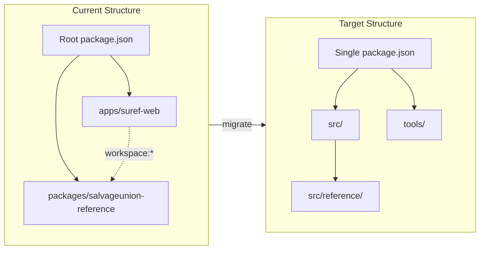

# Flatten Monorepo to Single Bun Application

## Current vs Target Structure



## Key Files to Modify

- [package.json](package.json) - Merge dependencies, remove workspaces
- [tsconfig.json](tsconfig.json) - Simplify to single project config
- [netlify.toml](apps/suref-web/netlify.toml) - Update paths, move to root
- [bunfig.toml](bunfig.toml) - Merge test config
- [.github/workflows/ci.yml](.github/workflows/ci.yml) - Remove workspace filters
- [apps/suref-web/eslint.config.js](apps/suref-web/eslint.config.js) - Merge with package config

## Phase 1: Move Web App to Root

Move from `apps/suref-web/` to root:

- `src/` directory
- `public/` directory
- `supabase/` directory
- Config files: `vite.config.ts`, `index.html`, `happydom.ts`, `testing-library.ts`

## Phase 2: Move Reference Library to src/reference/

- Move `packages/salvageunion-reference/lib/*` to `src/reference/`
- Move `packages/salvageunion-reference/data/` to `src/reference/data/`
- Move `packages/salvageunion-reference/schemas/` to `src/reference/schemas/`
- Move `packages/salvageunion-reference/tools/` to `tools/`

## Phase 3: Update Imports (127 files)

Change all imports from:

```typescript
import { SalvageUnionReference } from 'salvageunion-reference'
```

To relative imports based on file location:

```typescript
import { SalvageUnionReference } from '../reference'
```

## Phase 4: Update Reference Library Internal Paths

In [ModelFactory.ts](packages/salvageunion-reference/lib/ModelFactory.ts), change:

```typescript
// From (when in lib/)
import abilitiesData from '../data/abilities.json'
// To (when in src/reference/)
import abilitiesData from './data/abilities.json'
```

## Phase 5: Update Tools Path References

All tools in `tools/` need path updates. Example for [checkUniqueIds.ts](packages/salvageunion-reference/tools/checkUniqueIds.ts):

```typescript
// From
const filePath = join(process.cwd(), 'data', filename)
// To
const filePath = join(process.cwd(), 'src', 'reference', 'data', filename)
```

## Phase 6: Merge Configuration Files

- Merge both `package.json` files, remove `workspaces` config
- Merge both `eslint.config.js` files
- Simplify `tsconfig.json` (remove composite/incremental)
- Update `bunfig.toml` with merged test config

## Phase 7: Update Netlify Configuration

Move `netlify.toml` to root, update:

```toml
[build]
  command = "bun install --frozen-lockfile && bun run build"
  publish = "dist/client"
```

## Phase 8: Update CI and Cursor Rules

- Simplify CI workflow (remove `--filter` commands)
- Delete `.cursor/rules/monorepo-patterns.mdc`
- Update `.cursor/rules/package-development.mdc` for new structure

## Phase 9: Cleanup

- Delete `apps/` and `packages/` directories
- Regenerate `bun.lock`
- Run verification: `bun run check:all`

## Verification Checklist

- TypeScript compiles without errors
- All tests pass
- Linting passes
- Data validation passes
- App runs locally
- Netlify preview deploy succeeds
