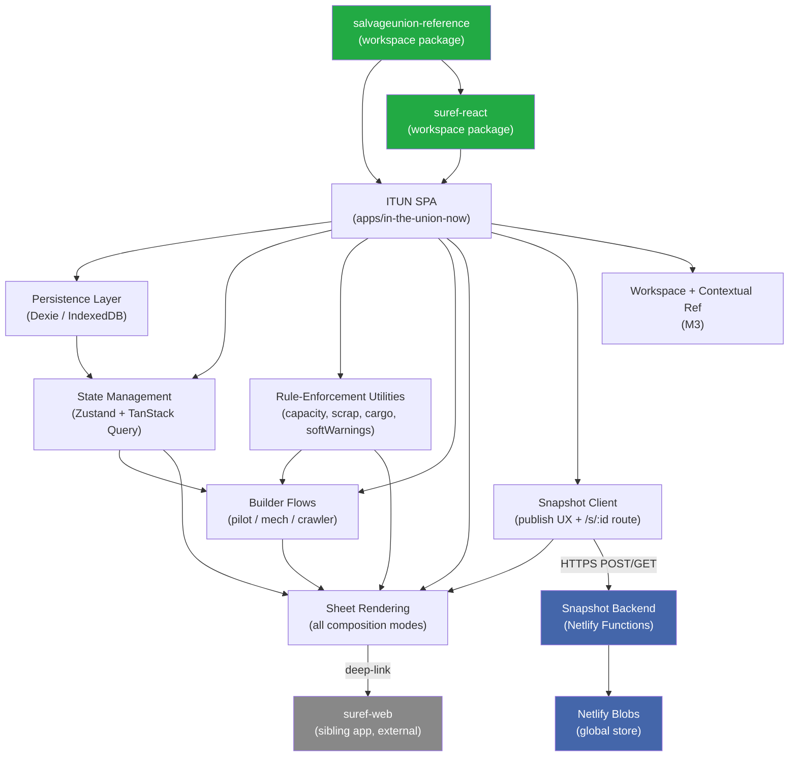

# In The Union Now (ITUN) Revamp — Architecture

## 1. Introduction and Goals

### 1.1 Requirements Overview

Load-bearing Must-Have requirements grouped by theme. Full list of all 62 REQ-IDs is in Appendix C; the table below highlights the 12 requirements that shape the most fundamental architectural decisions.

| REQ-ID | Requirement | Why Load-Bearing |
|--------|-------------|-----------------|
| REQ-001 | Build a standalone pilot | Drives the composability data model (no parent-owns-child) |
| REQ-002 | Build a standalone mech (auto stand-in pilot) | Same; plus triggers capacity/scrap enforcement design |
| REQ-003 | Build a standalone crawler | Completes the three-entity composability requirement |
| REQ-004 | Wire entities via soft links | Defines the SoftLink join-record pattern |
| REQ-006 | Local-first IndexedDB persistence | Pins Dexie as the persistence layer; drives offline-first design |
| REQ-009 | Capacity and budget enforcement | Drives pure-TS rule-enforcement utility architecture |
| REQ-017 | Publish anonymous snapshot | Drives the Snapshot Backend design (ADR-001) |
| REQ-018 | Open published snapshot by URL | Pins capability-token URL security model |
| REQ-019 | Print-quality A4 + US Letter sheets | Drives print-stylesheet-as-first-class-deliverable approach |
| REQ-NF-06 | No PII collected | Pins anonymous-only publish model |
| REQ-NF-10 | WCAG 2.1 AAA on sheet view | Drives color/contrast design system decisions |
| REQ-NF-18 | All shared UI via `suref-react` | Pins shared-package dependency structure |

For the full requirements list (REQ-001..028, REQ-NF-01..22, REQ-W-01..12) see PRD §5 and Appendix C of this document.

### 1.2 Quality Goals

| Priority | Quality Goal | Motivation |
|----------|-------------|------------|
| 1 | **Accessibility (AAA on sheet / AA elsewhere)** | Sheet view is used at the table on a phone under poor light; WCAG 2.1 AAA is the stated target and is CI-enforced via `a11y-scan`. AA for all other views. (REQ-NF-10, REQ-NF-11) |
| 2 | **Local-first reliability** | All build/edit/save/load/print operations must be fully offline-capable after initial load. Only snapshot publishing requires network. Prevents data loss and table friction. (REQ-007, REQ-NF-07) |
| 3 | **Performance — TTI and save latency** | ≤ 3.0 s TTI on broadband desktop; ≤ 100 ms local save latency; 60 FPS sheet scroll on mobile. Keeps the "10-minute first build" target credible. (REQ-NF-01, REQ-NF-02, REQ-NF-03) |
| 4 | **Maintainability via shared packages** | All game data exclusively via `salvageunion-reference`; all shared UI via `suref-react`. Prevents fragmentation, preserves the data-quality moat, and ensures `suref-web` and future consumers remain aligned. (REQ-NF-18, REQ-NF-19) |
| 5 | **Print fidelity (A4 + US Letter)** | Professional print output is a core differentiator against community spreadsheets. Treated as a first-class deliverable with a mandatory maintainer review gate. (REQ-019, REQ-NF-13, REQ-NF-14) |

### 1.3 Stakeholders

| Role | Name / Team | Expectations |
|------|------------|--------------|
| **Sole Maintainer** | alxjrvs | Writes all code; makes all architecture decisions; defines quality bar; performs manual review gates (print, a11y, timing study). Expects a codebase they are not dreading working in. |
| **AI Development Partner** | Claude Code (Anthropic) | Executes implementation under maintainer direction; drives high-leverage automation stories; follows all repo conventions and CLAUDE.md rules exactly. |
| **SU Player Community** | Individual Salvage Union players | Primary recipients of the shipped product. Want a frictionless, composable, link-shareable, print-quality character builder with no account required. |
| **Upgrade-path persona: Table-Runner** | SU GMs/Mediators | Not served at MVP; architecture must not foreclose GM tools, multiplayer, or live-combat automation. |
| **Upgrade-path persona: Party Group** | Full SU table (1 GM + 3–5 players) | Not served at MVP; real-time multiplayer and shared workspaces are explicitly deferred. |

---

## 2. Architecture Constraints

| Type | Constraint | Rationale |
|------|-----------|-----------|
| Technical | **Bun** as runtime and package manager | Workspace standard; all root scripts use `bun --filter`; do not substitute npm/yarn |
| Technical | **TypeScript 5.9+** throughout | Workspace standard; strict mode; `type` over `interface` |
| Technical | **ShadCN + Tailwind v4** for UI | Workspace standard; `suref-react` theme is Tailwind v4; `@source` paths must include `suref-react` |
| Technical | **Zustand + TanStack Query** for state | No React Context per repo conventions; Zustand for ephemeral UI; TanStack Query for async data (including local Dexie) |
| Technical | **Zod v4** for all schema validation | Workspace and `salvageunion-reference` standard; local entity schemas use Zod; types inferred via `z.infer` |
| Technical | **Relative imports only** — no `@/` path aliases | Per repo CLAUDE.md and `.claude/rules/monorepo-patterns.md`; enforced by ESLint |
| Technical | **Named exports everywhere** except TanStack Router file-based route components | Per repo coding conventions |
| Technical | **`import type`** for type-only imports | Per repo conventions |
| Technical | **`suref-react`** — no fork, no parallel reimplementation | Primary shared UI source; components that prove generally useful in ITUN are promoted up, not forked |
| Technical | **`salvageunion-reference`** — sole game data source | No inline copies of chassis names, ability text, roll-table entries anywhere in ITUN |
| Technical | **Browser support floor: Safari ≥ 16** | Evergreen browsers only; modern CSS (container queries, View Transitions, native dialog) is fair game |
| Technical | **WCAG 2.1 AAA** on sheet view; **AA** on all other views | Hard quality bar; enforced by `a11y-scan` CI skill using puppeteer-core + axe-core |
| Technical | **A4 and US Letter print** both required | Print stylesheet is a first-class deliverable, not an afterthought |
| Technical | **Lefthook pre-commit + pre-push** hooks must pass | pre-commit: lint+format+typecheck; pre-push: test+validate; `--no-verify` is prohibited |
| Technical | **No Supabase at MVP** | Legacy Supabase project (`dshtuchbleipwqacyokz`) decommissioned; zero real users to migrate |
| Organizational | **Solo-maintainer capacity** | One maintainer (alxjrvs) + AI assistance. No sprint commitments, no hard deadlines. Quality-gated release only. |
| Organizational | **No hard deadline** | Quality bar gates release; timeline is weeks-to-months, not days |
| Organizational | **Zero users to migrate** | Legacy ITUN has no real users; legacy archived to `apps/itun-legacy/`; no migration path needed |
| Organizational | **Won't-Have list is binding** | REQ-W-01..12 are not implemented in this iteration; every PR touching out-of-scope concerns is rejected or scoped back |

---

## 3. System Scope and Context

### 3.1 Business Context

ITUN is a browser-based single-player Salvage Union character builder. The system boundary separates what ITUN owns (build, persist, publish, print) from external actors and systems it interacts with.

| Actor | Input to ITUN | Output from ITUN | Description |
|-------|---------------|-----------------|-------------|
| **Individual Player** | Build choices (class, chassis, abilities, systems, modules, cargo), stat edits, workspace names, publish action | Saved builds, sheet view, short URL, printed sheet | Primary user; solo play context; no account required |
| **Snapshot Recipient** | Short URL (received from the Individual Player via Discord/text/forum) | Read-only sheet view of the published build | Any person with the URL; no account, no install |
| **Maintainer (alxjrvs)** | Code, data, deployment | Running application, CI reports, print previews | Sole developer; also acts as a player-tester |
| **`suref-web` (sibling app)** | Deep-link clicks from ITUN contextual reference | SRD entity pages for full SU rules browsing | Out-of-scope reference site; ITUN links out, does not duplicate |
| **`salvageunion-reference` (workspace package)** | TypeScript imports | Typed SU game data (chassis, systems, abilities, roll tables, etc.) | Canonical game data source; no change in this revamp |
| **`suref-react` (workspace package)** | TypeScript imports | Shared UI components, theme, entity display system | Shared component library; no change in this revamp |

### 3.2 Technical Context

| Channel / Interface | Protocol | Direction | Description |
|--------------------|----------|-----------|-------------|
| Browser ↔ IndexedDB | Dexie v4 API (browser-native IndexedDB) | Bidirectional | Primary persistence for Pilot, Mech, Crawler, Workspace, SoftLink, Pattern, WorkspaceAssignment; local-only; offline-capable |
| ITUN SPA → Snapshot Backend | HTTPS POST `/api/snapshots` | Outbound | Anonymous build publish; payload validated with Zod; returns `{ id, url }` |
| Browser → Snapshot Backend | HTTPS GET `/api/snapshots/:id` | Outbound (read) | Snapshot retrieval by short ID; returns JSON or 404 |
| Snapshot Backend → Netlify Blobs | `@netlify/blobs` SDK (server-side) | Internal (within Netlify) | Snapshot JSON storage and retrieval; global store in production; deploy-scoped in staging |
| ITUN SPA → `suref-web` | URL deep-link (`<a href>`) | Outbound | Contextual "View in SRD →" links to `suref-web` entity pages; `/schema/[schemaId]/item/[itemId]` |
| Build artifacts → Netlify CDN | HTTP/S static asset delivery | Outbound to users | Vite-built SPA served from Netlify CDN |
| `salvageunion-reference` → ITUN SPA | TypeScript workspace import; `preload()` async API | Inbound (build-time + runtime) | Game data (schemas, roll tables, entities); selective lazy-load via `preload([...schemas])` |
| `suref-react` → ITUN SPA | TypeScript workspace import (no build step) | Inbound (build-time) | Shared UI components; exports TypeScript source directly |

---

## 4. Solution Strategy

| Goal | Approach | Technology / Pattern |
|------|---------|---------------------|
| **Composability — independent first-class entities** | Pilot, Mech, Crawler stored as independent IndexedDB records; relationships expressed as `SoftLink` join records; no parent-owns-child hierarchy | SoftLink data model; Dexie tables per entity type; auto stand-in rendering |
| **Local-first reliability** | IndexedDB as authoritative local store; all CRUD operations work offline; snapshot publishing is a one-way opt-in network action | Dexie v4; TanStack Query wrapping Dexie as queryFn; service worker / Vite build caching for offline-capable SPA |
| **Rule enforcement without hard procedural control** | Capacity, scrap, cargo computed by pure TypeScript utilities; violations surface as warnings that can be overridden (honor system) | `capacity.ts`, `scrap.ts`, `cargo.ts`, `softWarnings.ts` utilities; Zod schemas for structural validation |
| **Anonymous publishing with no accounts** | One-click publish serializes build to JSON, POSTs to Netlify Function, receives nanoid short URL; URL itself is the capability token; no user identity | Netlify Functions + Blobs; `nanoid` short IDs (~128-bit entropy); capability-token URL model (ADR-001) |
| **Print-quality sheets** | Pure CSS `@media print` + `@page` rules; A4 default with user-toggleable US Letter; maintainer visual review gate | CSS print media queries; no PDF library (ADR-005) |
| **Accessibility at AAA / AA** | SU theme colors audited against AAA on sheet surfaces; AA on all other surfaces; `a11y-scan` CI enforces zero violations | puppeteer-core + axe-core `a11y-scan` skill; WCAG 2.1 AAA/AA targets |
| **Shared-package preservation** | All game data via `salvageunion-reference`; all shared UI via `suref-react`; ITUN-only components promoted to `suref-react` on stabilization | Workspace import (`workspace:*`); `docs/architecture/package-contracts.md` checklist |
| **Multiplayer-credible upgrade path** | SoftLink records, Workspace records, and Zod entity schemas carry optional `cloudId` / `ownerId` fields from v1; blob metadata allows auth layering without snapshot rewrite | ADR-006; upgrade-path-aware Zod schema design |
| **Solo-maintainer sustainability** | No hard deadline; quality-gated milestones; AI-leveraged workflow; each Must-Have is independently shippable | M1 → M2 → M3 gate structure; Claude Code automation for high-leverage stories |

---

## 5. Building Block View

### 5.1 Level 1 — System Overview

#### Unit: Shared Packages (Preserved)

**Purpose:** Provide the canonical SU game data ORM and shared UI component library. These packages are the project's core moat and are not modified in this revamp beyond receiving new components that stabilize in ITUN.

**Responsibilities:**
- `salvageunion-reference`: All SU game data (27+ schemas), Zod validation, TypeScript ORM, lazy-load `preload()` API
- `suref-react`: SU-themed React component library — theme system, typography, entity display system (`DisplayCard`, `ReferenceEntityDisplay`), UI primitives, shared utilities

**Deliverables:**
- Preserved as-is from current state; no deliverables in this revamp
- ITUN components that prove generally useful are promoted here post-stabilization (per `package-contracts.md`)

**Dependencies:**
- None (leaf packages in the dependency graph)

---

#### Unit: ITUN SPA

**Purpose:** The primary deliverable — a local-first single-player Salvage Union character builder. Handles all build/edit/save/delete/print/share flows for pilots, mechs, and crawlers.

**Responsibilities:**
- Builder flows for all three entity types (standalone and wired)
- Rule enforcement (capacity, scrap, cargo, soft-warnings)
- Local persistence via Dexie (IndexedDB)
- Sheet rendering (all four composition modes) with live stat editing
- Print stylesheet (A4 + US Letter)
- Workspace grouping (local-only)
- Contextual SU reference display + deep-links to `suref-web`
- Snapshot publish UX (call backend, display short URL)
- Snapshot open UX (route `/s/:id`, render read-only sheet)
- JSON import/export (Should-Have, M4)

**Deliverables:**
- `apps/in-the-union-now/` — greenfield Vite + React 19 + TanStack Router SPA
- IndexedDB schema (v1) for Pilot, Mech, Crawler, Workspace, SoftLink, Pattern, WorkspaceAssignment
- Rule-enforcement utilities (`capacity.ts`, `scrap.ts`, `cargo.ts`, `softWarnings.ts`) with unit tests
- Builder flows (M1), sheet + print + snapshot UX (M2), workspace + contextual reference (M3)

**Dependencies:**
- Shared Packages (workspace imports)
- Snapshot Backend (HTTPS; M2+)

---

#### Unit: Snapshot Backend

**Purpose:** A thin anonymous-publish-and-retrieve API providing immutable short-URL snapshots of builds. The only server-side component in the MVP.

**Responsibilities:**
- Accept POST publish requests; validate payload; generate nanoid short ID; store in Netlify Blobs
- Accept GET retrieve requests by short ID; return snapshot JSON or 404
- Enforce per-IP rate limiting (30 publishes/hour/IP) via Blobs-backed counter
- Enforce immutability (no PATCH/PUT/DELETE routes)
- Enforce no-PII policy (Zod validation strips identifying fields)

**Deliverables:**
- `netlify/functions/snapshots/publish.ts` — POST endpoint
- `netlify/functions/snapshots/retrieve.ts` — GET endpoint
- Rate-limit counter logic using `rate::{ip_hash}::hour` Blobs key
- Netlify Blobs global store for production; deploy-scoped for staging/preview

**Dependencies:**
- Netlify Blobs (`@netlify/blobs`) — auto-provisioned, no additional account

---

#### Unit: Legacy Archive

**Purpose:** Preserve the existing `apps/in-the-union-now/` codebase at a tagged commit for future pattern-mining without active maintenance.

**Responsibilities:**
- Accept the archived code at `apps/itun-legacy/`
- Document frozen status in a `README` within the directory
- Receive a Git tag at the archive commit point

**Deliverables:**
- `apps/itun-legacy/` with frozen README
- Git tag `itun-legacy-archive-YYYYMMDD`
- Decommission documentation for Supabase project `dshtuchbleipwqacyokz`

**Dependencies:**
- None (standalone archive; no build integration)

---

### 5.2 Level 2 — Unit Internals (complex units only)

#### Unit: ITUN SPA

##### Subcomponent: Persistence Layer

**Purpose:** Provide the authoritative local data store for all ITUN entities.

**Interfaces:**
- Consumed by TanStack Query `queryFn`/`mutationFn` adapters
- Consumed by Zustand stores for workspace/entity CRUD calls
- Zod schemas define entity types; TypeScript types inferred via `z.infer`

**Key decisions:**
- Dexie v4 selected (ADR-002): first-class schema versioning, TypeScript-native, `.version(n).upgrade()` migration API
- Tables: `pilots`, `mechs`, `crawlers`, `workspaces`, `softLinks`, `patterns`, `workspaceAssignments`
- Schema v1 includes optional `cloudId` field on all entity tables for upgrade-path-aware design (ADR-006)
- Dexie singleton exported from `src/lib/db.ts`; shared across all consuming modules

##### Subcomponent: State Management Layer

**Purpose:** Separate ephemeral UI state (Zustand) from async entity data (TanStack Query).

**Interfaces:**
- React components consume Zustand stores via hooks (`useEntityStore`, `useWorkspaceStore`, `useUiStore`)
- React components consume TanStack Query via standard `useQuery`/`useMutation` hooks
- TanStack Query `queryFn`s call Dexie; `mutationFn`s call Dexie and invalidate relevant query keys

**Key decisions:**
- Zustand holds ephemeral state only: active workspace, open panels/modals, soft-warning dialog state, current edit mode
- TanStack Query wraps Dexie as if it were a network API — provides loading, error, optimistic update, and cache invalidation uniformly for both local (Dexie) and remote (snapshot) operations
- No React Context anywhere; all state via Zustand + TanStack Query (ADR-004)

##### Subcomponent: Rule-Enforcement Utilities

**Purpose:** Pure TypeScript functions that compute constraint violations and soft warnings, callable synchronously during builder flows.

**Interfaces:**
- Called by builder flow components on each entity state change
- Called on every save event by the soft-warning dialog orchestrator
- Consumed by unit tests (no React dependency)

**Key decisions:**
- `capacity.ts`: computes remaining system/module slots; returns `{ allowed: boolean, reason?: string }`
- `scrap.ts`: handles TL1–TL6 tier translation per SU rules
- `cargo.ts`: computes cargo capacity across custom and reference-linked items
- `softWarnings.ts`: detects rule violations (level locks, tech-level gates, etc.) and returns warning message array
- All four utilities are pure functions with no side effects; unit-tested in M1

##### Subcomponent: Builder Flows

**Purpose:** Multi-step or tabbed UI for composing pilot, mech, and crawler entities.

**Interfaces:**
- Consume `salvageunion-reference` via selective `preload()` on route entry
- Consume rule-enforcement utilities synchronously
- Consume `suref-react` `ReferenceEntityDisplay` for contextual inline entity displays (M3)
- Write to Persistence Layer via TanStack Query mutations

**Key decisions:**
- Each entity type has an independent builder (no cross-builder prompting)
- Mech builder integrates capacity enforcement inline — blocking UI on slot-exceeded attempts
- Pilot builder integrates roll-table UI via `salvageunion-reference` roll-table data
- Auto stand-in rendering: when a builder flow preview renders an absent linked entity, a styled placeholder section (not blank fields) is shown

##### Subcomponent: Sheet Rendering

**Purpose:** Render complete read-only or editable sheets for all four composition modes.

**Interfaces:**
- Reads from Persistence Layer via TanStack Query
- Live stat editing writes back via TanStack Query mutations (optimistic; ≤ 100 ms)
- Print stylesheet (`@media print`) applies automatically on browser print action
- Read-only mode used for snapshot view (no edit controls rendered)

**Key decisions:**
- Four composition modes: pilot-only, mech-only, crawler-only, wired (all three)
- Click-to-edit: HP/AP/TP/SP/EP/Heat each use inline editable input (native `contenteditable` or Radix-controlled); blur/Enter commits
- Print stylesheet: pure CSS `@media print` + `@page` rules; A4 default; US Letter via toggle; no external PDF library (ADR-005)
- Auto stand-in sections render `[No Pilot Assigned]` etc. in all partial-composition modes
- WCAG 2.1 AAA color/contrast on all sheet surfaces; CI-gated in M3

##### Subcomponent: Snapshot Client

**Purpose:** Handle the publish-and-share flow and the snapshot-open route.

**Interfaces:**
- Publish: TanStack Query `useMutation` → POST `/api/snapshots`
- Open: TanStack Router route `/s/:snapshotId` → TanStack Query `useQuery` → GET `/api/snapshots/:id` → read-only sheet

**Key decisions:**
- Publish is a one-way action; the local build is not affected by or linked to the published snapshot
- Short URL displayed with copy-to-clipboard button after successful publish
- `SnapshotView` component is the same sheet renderer in read-only mode; no duplicate rendering code

---

### 5.3 Build Order

| Order | Unit | Rationale |
|-------|------|-----------|
| 1 | **Shared Packages (Preserved)** | Prerequisite for all ITUN SPA work; `bun run build:package` must succeed before app can resolve types |
| 2 | **Legacy Archive** | Archive legacy app first (M1 kickoff action) to prevent accidental mixed development |
| 3 | **ITUN SPA — Persistence Layer** (M1) | Foundational layer; all builder flows depend on it |
| 4 | **ITUN SPA — State Management Layer** (M1) | Wraps Persistence; consumed by all builder and sheet components |
| 5 | **ITUN SPA — Rule-Enforcement Utilities** (M1) | Pure logic; unblocked; test-driven; consumed by builders |
| 6 | **ITUN SPA — Builder Flows** (M1) | Core user-facing feature; depends on Persistence, State, and Rule utilities |
| 7 | **ITUN SPA — Sheet Rendering** (M2) | Depends on M1 entity data model; adds live-stat editing and print stylesheet |
| 8 | **Snapshot Backend** (M2) | Independent of SPA data model; backend ADR written at M2 start |
| 9 | **ITUN SPA — Snapshot Client** (M2) | Connects SPA to Snapshot Backend; depends on both |
| 10 | **ITUN SPA — Workspace + Contextual Reference** (M3) | Polish layer; depends on all M1/M2 SPA components |
| 11 | **A11y Certification + Launch** (M3) | Final gate; depends on complete SPA feature set |

### 5.4 Dependency Matrix



---

## 6. Runtime View

### Scenario: SC-01 — Build a standalone pilot (REQ-001, REQ-010)

User selects "New Pilot" from the dashboard. TanStack Router navigates to `/pilots/new`. The pilot wizard component loads pilot-related schemas via `SalvageUnionReference.preload(['classes', 'abilities', 'equipment', 'rollTables'])`. The user completes class selection, ability picks (filtered by class), equipment selection (capacity-enforced), and roll-table results for callsign/motto/keepsake/appearance. On "Save," `entityStore.createPilot(data)` is called, which writes a new `Pilot` record to IndexedDB via Dexie. No mech or crawler record is required. The pilot list page immediately reflects the new entry via TanStack Query cache invalidation on `pilotKeys.all`.

---

### Scenario: SC-02 — Build a standalone mech (REQ-002, REQ-009, REQ-013, REQ-014, REQ-015)

User selects "New Mech." The mech builder loads `['chassis', 'systems', 'modules', 'cargo']` schemas. The user selects a chassis (slot layout displayed from `chassis.systemSlots` and `chassis.moduleSlots`). Each system/module addition calls `capacity.ts` synchronously — if slots are exceeded, the addition is blocked with a clear UI error (REQ-009). Scrap budget and cargo capacity are recomputed on each addition via `scrap.ts` and `cargo.ts`. On save, a `Mech` record is written to IndexedDB. No pilot record is required; the sheet preview renders with an "auto stand-in" pilot section. The user may optionally save the build as a named `Pattern` record (REQ-013).

---

### Scenario: SC-03 — Build a standalone crawler (REQ-003, REQ-005)

User selects "New Crawler." The crawler builder loads `['crawlers', 'crawlerBays', 'techLevels']` schemas. The user configures crawler name, tech level, bays, and systems. No pilot assignment is required; the sheet preview shows a "No pilots assigned" stand-in. On save, a `Crawler` record is written to IndexedDB.

---

### Scenario: SC-04 — Wire entities together (REQ-004)

From any entity detail view, the user selects "Assign Mech" (on a pilot) or "Assign Pilot" (on a crawler). A selection modal lists compatible existing entities. On confirm, a `SoftLink` record is written to IndexedDB. The sheet view for the pilot now renders the linked mech's data inline. Deleting the mech later removes the `SoftLink` record and reverts the pilot sheet to the auto stand-in for mech — the pilot record itself is unaffected.

---

### Scenario: SC-05 — Publish a snapshot (REQ-017, REQ-NF-04..06)

From the sheet view, user clicks "Publish." The ITUN SPA serializes the current build to a JSON payload (stripping any ephemeral UI state). TanStack Query's `useMutation` calls `POST /api/snapshots` with the payload. The Netlify Function validates the payload with Zod (no PII fields), checks the per-IP rate counter in Netlify Blobs (`rate::{ip_hash}::hour`), generates a `nanoid`-derived short ID (~21 chars, ~128-bit entropy), and writes `snapshots::{id}` to the global Netlify Blobs store. The Function returns `{ id, url: "https://[domain]/s/{id}" }`. The SPA displays the short URL with a copy-to-clipboard button. Total network round-trip budget: < 2 s on broadband.

If the IP has exceeded 30 publishes in the current hour, the Function returns HTTP 429 and the SPA shows a friendly rate-limit message.

---

### Scenario: SC-06 — Open a published snapshot (REQ-018)

A friend receives the URL `https://[domain]/s/abc123`. TanStack Router matches the route `/s/:snapshotId`. The `SnapshotView` component mounts; TanStack Query calls `GET /api/snapshots/abc123`. The Netlify Function reads from Netlify Blobs and returns the JSON. The SPA renders the build in a read-only sheet view (no edit controls, no publish button). If the snapshot ID is unknown, the Function returns 404 and the SPA shows a "Snapshot not found" page.

---

### Scenario: SC-07 — Print a sheet (REQ-019, REQ-NF-13, REQ-NF-14)

From the sheet view, user clicks "Print" or uses Ctrl/Cmd+P. The browser print dialog opens. The CSS print stylesheet (`@media print`) hides navigation, edit controls, and sidebars; displays only the sheet content. `@page` rules set margins for A4 (default) and US Letter (user-selectable toggle). Page breaks are inserted before the mech section in wired sheets via `break-before: page`. Fonts are embedded via `@font-face` WOFF2 with local fallbacks (reusing screen-loaded fonts). The maintainer visual review gate in M2 DoD confirms professional fidelity before release.

---

### Scenario: SC-08 — Edit sheet stats live (REQ-016)

On the sheet view, the user clicks a stat value (e.g., HP). The stat field transitions to an inline edit mode. The user types the new value and blurs or presses Enter. TanStack Query's `useMutation` calls `entityStore.updatePilot(id, { hp: newValue })`, which writes to IndexedDB. The mutation applies an optimistic update immediately (< 100 ms, REQ-NF-02). If the Dexie write fails, the rollback path reverts the displayed value and shows a toast.

---

### Scenario: SC-09 — Capacity enforcement blocks a system add (REQ-009)

During mech building, the user attempts to add a system to a slot that is already full. `capacity.ts` is called synchronously with the current mech state + the candidate system. It returns `{ allowed: false, reason: 'No system slots remaining (3/3 used)' }`. The UI shows a non-dismissible inline error on the slot target; the add action does not proceed. No Dexie write occurs.

---

### Scenario: SC-10 — Soft-warning progression edit (REQ-012)

The user opens a saved pilot and adds an ability marked in `salvageunion-reference` as level-4-locked. On "Save," `softWarnings.ts` is called and returns a warning: `"Bionic Senses is normally available at level 4. This pilot is level 2."` A modal presents the warning and two options: "Save anyway" and "Cancel." If the user confirms, the Pilot record is written to IndexedDB with the ability added. The soft warning is stored alongside the pilot record as a `softWarningFlags` field for display on the sheet.

---

## 7. Deployment View

| Environment | Host / Platform | Notes |
|------------|----------------|-------|
| **Development** | Local machine; `bun run dev:itun` (Vite dev server on `localhost:5173`) | IndexedDB is real browser storage; Netlify Blobs emulated via `@netlify/vite-plugin-tanstack-start` local sandbox; no production data risk |
| **Staging** | Netlify Deploy Preview (auto-created per PR; URL: `https://deploy-preview-NNN--[site].netlify.app`) | Uses deploy-scoped Netlify Blobs store (not global production store); snapshot isolation prevents staging data from polluting production |
| **Production** | Netlify production deploy (`https://[canonical-itun-domain]`); SPA redirect rule `/* → /index.html, 200` | Global Netlify Blobs store for cross-deploy snapshot persistence; Netlify CDN for static assets; TLS/HSTS enforced; CSP header in `netlify.toml` |

**Build commands:**
- CI/CD (Netlify): `bun run build:package:ci && bun --filter in-the-union-now build`
- Local: `bun run dev:itun` or `bun run build:itun`

**Deployment swap (M3 gate):** New ITUN goes live at the same canonical URL previously serving the legacy ITUN. The legacy app continues to run at `apps/itun-legacy/` in the repo but is no longer deployed to the canonical URL.

---

## 8. Cross-cutting Concepts

### 8.1 Tech Stack

All versions verified **2026-05-17**.

| Layer | Technology | Version / Notes |
|-------|-----------|----------------|
| SPA Framework | React | 19.2.0 (checked: `apps/in-the-union-now/package.json` + context7 `/facebook/react`) |
| Language | TypeScript | 5.9.3 (checked: root `package.json` + context7 `/microsoft/typescript`) |
| Build Tool | Vite | ^7.2.2 / 7.x line (checked: `apps/in-the-union-now/package.json` + context7 `/vitejs/vite`) |
| Client Router | TanStack Router | ^1.136.1 / v1 line (checked: `apps/in-the-union-now/package.json` + context7 `/tanstack/router`) |
| Async Data | TanStack Query | ^5.90.9 / v5 line (checked: `apps/in-the-union-now/package.json` + context7 `/tanstack/query`) |
| Client State | Zustand | ^5.0.11 / v5 line (checked: `apps/in-the-union-now/package.json` + context7 `/pmndrs/zustand`) |
| Validation | Zod | ^4.3.6 / v4 line (checked: `packages/salvageunion-reference/package.json` + context7 `/colinhacks/zod`) |
| Local Persistence | Dexie | ^4.x (checked: context7 `/dexie/dexie.js` — v4 migration API confirmed) |
| UI Components | ShadCN + Radix UI | ShadCN: CLI-managed (no pkg version); Radix: per-component (checked: `apps/in-the-union-now/components.json` in-repo) |
| Styling | Tailwind CSS v4 | 4.2.1 (checked: root `package.json` + context7 `/tailwindlabs/tailwindcss.com`) |
| Shared Components | `suref-react` | workspace:* — no build step; TypeScript source exports |
| Game Data ORM | `salvageunion-reference` | workspace:* — TypeScript + Zod v4 + JSON; `bun run build:package` required |
| Runtime / PM | Bun | 1.3.14 (checked: `bun --version` on host + context7 `/oven-sh/bun`) |
| Snapshot Compute | Netlify Functions (TypeScript) | `@netlify/functions` latest (checked: Netlify MCP coding rules) |
| Snapshot Storage | Netlify Blobs | `@netlify/blobs` latest (checked: Netlify MCP coding rules) |
| Short ID Generation | nanoid | ~21 chars, ~128-bit entropy |
| Lint / Format | ESLint 10 + Prettier 3 | 10.0.3 / 3.8.1 (checked: root `package.json`) |
| Pre-commit / pre-push | Lefthook | 2.1.4 (checked: root `package.json`) |
| A11y CI | puppeteer-core + axe-core | per `tools/a11y-scan.ts` in root |
| Testing | Bun test runner + React Testing Library | Bun 1.3.14 / RTL 16.3.2 (checked: root `package.json`) |

### 8.2 Architectural Patterns

- **Local-first:** IndexedDB (via Dexie) is the authoritative source of truth. All build/edit/save/delete/print operations are fully offline-capable after the first app load. Network is only required for snapshot publishing.
- **Immutable snapshots:** Published builds are write-once. The Snapshot Backend stores a JSON blob by nanoid key; no update or delete routes are exposed. The short URL is the capability token — possessing it is sufficient to read the snapshot.
- **Soft-link composability:** Pilot, Mech, and Crawler are independent top-level entities connected by lightweight `SoftLink` join records. Deletion of one entity removes its SoftLinks but does not cascade to the other entity. This replaces the legacy `pilot → owns → mech` nesting model.
- **Auto stand-in rendering:** Sheets render cleanly for all partial-composition modes by displaying styled placeholder sections (`[No Pilot Assigned]`) rather than blank fields or dummy stats.
- **Honor system rule enforcement:** ITUN enforces economic constraints (capacity, scrap, cargo, tech-level gates) but not procedural adjudication (turn order, action resolution, table governance). The `softWarnings.ts` utility detects violations and surfaces confirm-or-cancel dialogs; it never hard-blocks save.
- **TanStack Query as local-async adapter:** TanStack Query wraps Dexie reads as `queryFn` adapters — the "server" is IndexedDB. This provides loading state, error handling, cache invalidation, and optimistic mutations uniformly for both local (Dexie) and remote (snapshot) data operations, without duplicating state management patterns.
- **Capability-token URL sharing:** Anonymous snapshot URLs are sufficiently unguessable (~128-bit entropy nanoid) to function as access tokens. No auth layer needed at MVP. The URL is the permission.
- **Shared-package reuse over local implementation:** All cross-cutting UI from `suref-react`; all game data from `salvageunion-reference`. New ITUN-specific components that prove generally useful are promoted to `suref-react` after stabilization rather than forked in place.
- **Upgrade-path-aware schema design:** Zod entity schemas include optional `cloudId` fields from v1; Snapshot Backend blob metadata supports future `ownerId` layering. Multiplayer and auth can be added without schema rewrites.

### 8.3 Conventions

- **Relative imports only** — never `@/` path aliases. Enforced by ESLint.
- **`type` over `interface`** for all object type declarations (unless interface extension is specifically needed).
- **`import type`** for all type-only imports.
- **Named exports** everywhere except TanStack Router file-based route components (which use default exports as required by the router's code-generation).
- **Zod schemas define entity types** — TypeScript types inferred via `z.infer<typeof Schema>`. No separate `interface` for entity shapes.
- **No React Context** — Zustand for ephemeral UI state; TanStack Query for async entity/snapshot data.
- **Bun** for all package management and script execution — `bun install`, `bun run`, `bun test`, `bun --filter`.
- **Conventional commits** — `feat:`, `fix:`, `chore:`, `refactor:`, `test:`, `docs:`.
- **One changelog entry per PR** — edit the existing entry on iteration; never add a new entry per intra-PR change.
- **Generated files not linted** — `routeTree.gen.ts` and similar code-gen outputs are excluded from ESLint.
- **`bun run check:all`** passes on every PR before merge: lint, format, typecheck, test, validate.
- **Lefthook hooks mandatory** — pre-commit (lint+format+typecheck) and pre-push (test+validate). `--no-verify` is prohibited.

### 8.4 Security

- **Transport:** TLS enforced by Netlify CDN; HSTS header in `netlify.toml`; all snapshot API calls over HTTPS.
- **Anonymous publish model:** No auth token required to publish a snapshot. The short URL itself is the capability token — sufficiently unguessable (~128-bit entropy nanoid). Possessing the URL is the permission to read the snapshot.
- **Rate limiting:** Per-IP counter stored in Netlify Blobs (`rate::{ip_hash}::hour` key); publish returns HTTP 429 if > 30 requests/hour/IP. This is a custom implementation (no managed rate-limit service), appropriate for < 10k snapshots/year scale.
- **Snapshot immutability:** Snapshot blobs are written once at publish time. No PATCH/PUT/DELETE routes are exposed on the Snapshot Backend.
- **No PII:** Snapshot payload validated by Zod to reject any field matching known PII patterns. IP address hashed for rate-limiting counter key but never stored in blob content.
- **Content Security Policy:** Existing `netlify.toml` CSP header; `connect-src` updated to include snapshot API path.
- **Spam / abuse:** Short IDs are not sequential or guessable; no snapshot listing endpoint exists. Low operational risk at projected scale (< 10k snapshots/year).
- **Denial-of-service:** Netlify's built-in DDoS protection + rate limiting handles the solo-project risk profile.
- **Compliance (REQ-NF-06):** No user identity, no email, no session ID, no IP stored in snapshot content. The app collects no personal data at MVP.
- **Environment isolation for Netlify Blobs:** Snapshot Function checks `Netlify.context?.deploy.context === 'production'` and uses global store in production vs. deploy-scoped store in staging/previews.

### 8.5 Error Handling

- **Offline tolerance:** All non-publish operations (build, edit, save, load, delete, print) must be fully functional offline after initial app load. The Vite build with service worker / asset caching provides offline SPA delivery.
- **IndexedDB write failures:** Errors surface as toast notifications with non-blocking recovery suggestions (e.g., "Storage may be full — free up browser storage and try again").
- **IndexedDB schema migration failures:** If a Dexie `.upgrade()` callback fails, a modal dialog presents the error and offers a "Download raw data and reset" escape hatch. Prevents silent data loss on schema version bumps. Migration paths are explicitly tested with each schema version increment.
- **Snapshot publish errors:** Network offline, rate-limit hit (HTTP 429), or server error (5xx) surfaces as a toast notification with a "Retry" button. The local build is not affected by a failed publish.
- **Snapshot retrieve errors:** HTTP 404 renders a "Snapshot not found" page with a link back to the builder dashboard. HTTP 5xx surfaces an error state with a retry button.
- **Capacity enforcement inline:** Over-slot or over-budget add attempts return an inline non-dismissible error on the offending slot target. The add operation is not queued or retried; the user must make a different selection.
- **Soft-warning dialog:** Rule violations surface a modal with "Save anyway" / "Cancel." If the user dismisses without saving, no Dexie write occurs. This is not an error — it is an expected user interaction.

---

## 9. Architecture Decisions

### ADR-001: Snapshot Publishing Backend — Netlify Functions + Blobs

**Status:** Accepted

**Context:**
The snapshot publishing requirement (REQ-017, REQ-018) needs: anonymous POST to publish, GET to retrieve by short ID, immutable storage, per-IP rate limiting, no PII, ≥ 1 year retention, solo-maintainer operability, Netlify-aligned hosting.

**Decision Drivers:**
- Operational simplicity for a solo maintainer
- Zero additional account/project to manage at MVP
- Netlify is the existing deployment target (confirmed by `netlify.toml`)
- Free-tier-appropriate at projected scale (< 10k snapshots/year)
- Auth-layering path must remain credible

**Considered Options:**

#### Option A: Netlify Functions + Blobs (selected)
- Good, because same project, zero additional infra, auto-provisioned
- Good, because same deploy pipeline as the SPA — snapshot functions deploy with the app
- Good, because `@netlify/vite-plugin-tanstack-start` already a dev dep; blobs emulated locally
- Good, because auth upgrade path via Netlify Identity without snapshot system rewrite
- Bad, because Netlify Blobs eventual consistency (acceptable for async share-link use case)
- Bad, because custom rate-limit implementation (not a managed service; acceptable at scale)
- Bad, because Netlify vendor lock-in for blob layer (mitigated: snapshot JSON could be migrated to another store with a script)

#### Option B: Cloudflare Workers + KV
- Good, because fast global edge, generous free tier, KV is well-suited to key-value snapshot storage
- Bad, because separate account/project from Netlify — two platform relationships to manage
- Bad, because operational overhead for solo maintainer

#### Option C: Supabase (new project, anon-only)
- Good, because familiar pattern (legacy ITUN used Supabase); supports auth upgrade path natively
- Bad, because new Supabase project after just decommissioning the old one
- Bad, because SQL + RLS for a key-value blob operation is over-engineered
- Bad, because contradicts "no more Supabase at MVP" direction

#### Option D: Upstash (Redis)
- Good, because fast, generous free tier; rate limiting via Redis INCR is the canonical pattern
- Bad, because extra account; Redis for immutable blobs is semantically awkward; extra vendor friction

#### Option E: Turso (SQLite)
- Good, because edge-native SQLite; familiar to TypeScript developers
- Bad, because relational DB for key-value blobs is over-engineered; extra account

**Decision Outcome:**
Use **Netlify Functions (TypeScript)** for the compute layer and **Netlify Blobs (global store)** for snapshot storage. Two functions: `POST /api/snapshots` (publish) and `GET /api/snapshots/:id` (retrieve). Rate limiting via Blobs-backed per-IP counter (`rate::{ip_hash}::hour`). Short IDs generated with `nanoid` (~21 chars, ~128-bit entropy). Snapshot payload validated with Zod before storage.

**Consequences:**
- Positive: Zero additional accounts or projects to manage
- Positive: Same deploy pipeline as the SPA
- Positive: Auth upgrade path: `ownerId` field can be layered into blob metadata without rewriting the storage model
- Negative: Netlify Blobs eventual consistency (acceptable for async share-link flow)
- Negative: Custom rate-limit implementation (acceptable at < 10k/year scale)
- Negative: Netlify vendor dependency for blob layer (mitigatable via migration script)

**Links:** REQ-017, REQ-018, REQ-NF-04, REQ-NF-05, REQ-NF-06, REQ-NF-08, REQ-NF-09

---

### ADR-002: Local Persistence Library — Dexie (over raw `idb` or `idb-keyval`)

**Status:** Accepted

**Context:**
The app needs IndexedDB persistence for Pilot, Mech, Crawler, Workspace, SoftLink, Pattern, and WorkspaceAssignment records. Schema will evolve across releases. The choice is between raw IndexedDB API, `idb` (thin promise wrapper), `idb-keyval` (key-value only), or Dexie (full ORM-style abstraction).

**Decision Drivers:**
- Schema migration support is load-bearing: builds may be persisted for years; changes must not lose user data
- TypeScript integration and type inference quality
- Bundle size impact relative to benefit
- DX for a solo maintainer writing complex multi-table queries

**Considered Options:**

#### Option A: Raw IndexedDB API
- Good, because zero bundle overhead
- Bad, because too much boilerplate for complex multi-table migrations; no TypeScript type inference; callback-heavy

#### Option B: `idb` (jakearchibald/idb)
- Good, because ~5 KB; promise-based
- Bad, because migration story is still manual; minimal DX uplift for the schema complexity needed

#### Option C: `idb-keyval`
- Good, because ~1 KB; extremely simple
- Bad, because KV-only; can't model relational structure (SoftLinks, WorkspaceAssignments) without an awkward layering

#### Option D: Dexie v4 (selected)
- Good, because first-class migration support (`.version(n).stores(...).upgrade()`)
- Good, because TypeScript-native table API with type inference built in
- Good, because readable query API (`.where()`, `.filter()`)
- Good, because v4 migration patterns are well-documented (context7 confirmed)
- Bad, because ~30 KB bundle addition (acceptable; reference data is ~1.1 MB)
- Bad, because abstracts away raw IndexedDB debugging; developer must understand Dexie's version model

**Decision Outcome:**
Use **Dexie v4** as the IndexedDB abstraction layer. Each entity type gets a typed Dexie table. Schema versioning starts at v1; future versions add `.upgrade()` callbacks per the Dexie migration API. The Dexie instance is a module-level singleton at `src/lib/db.ts`, consumed by TanStack Query `queryFn`s and Zustand stores.

**Consequences:**
- Positive: First-class migration support reduces risk of data loss on schema evolution
- Positive: TypeScript type inference built-in; no separate interface declarations needed
- Positive: Query API is readable and maintainable for a solo maintainer
- Negative: ~30 KB bundle addition (acceptable)
- Negative: Dexie abstracts away raw IndexedDB; developers must understand Dexie's version model

**Links:** REQ-006, REQ-007, REQ-008, REQ-NF-02

---

### ADR-003: App Framework — Vite + TanStack Router + React 19 SPA (over Astro 5)

**Status:** Accepted

**Context:**
The new ITUN could use Astro 5 (as `suref-web` does) with React islands, or the Vite + TanStack Router + React 19 SPA pattern (as the legacy ITUN uses). These have meaningfully different architectural implications for a local-first interactive app.

**Decision Drivers:**
- ITUN is a fully interactive SPA, not a content site with islands of interactivity
- Local-first persistence (IndexedDB) requires client-side JS on every route
- TanStack Router's type-safe route params are important for snapshot URLs and entity URLs
- Legacy ITUN already invested in the TanStack Router pattern

**Considered Options:**

#### Option A: Vite + TanStack Router + React 19 (selected)
- Good, because pure SPA; client-side routing; no SSR overhead; type-safe params
- Good, because `@netlify/vite-plugin-tanstack-start` already in devDeps
- Good, because direct continuation of legacy ITUN's framework stack; maintainer familiarity
- Good, because pure client-side SPA is the correct model for local-first IndexedDB apps
- Bad, because no SSR / server components (acceptable; snapshots rendered client-side)

#### Option B: Astro 5 + React islands
- Good, because used by `suref-web`; good for content-heavy static sites
- Bad, because poor fit for a fully interactive app: every ITUN route needs full React
- Bad, because Zustand + TanStack Query + Dexie are all client-only; Astro's partial hydration adds friction without benefit
- Bad, because Astro Router does not provide TanStack Router's type-safe param guarantees

**Decision Outcome:**
Retain **Vite + TanStack Router v1 + React 19** as the app shell. File-based routing in `src/routes/`. Direct continuation of the legacy ITUN's framework stack, minus Supabase and auth.

**Consequences:**
- Positive: Consistent with existing monorepo patterns; maintainer familiarity
- Positive: TanStack Router file-based routing generates type-safe `routeTree.gen.ts`
- Positive: `@netlify/vite-plugin-tanstack-start` dev dep enables local Netlify Functions + Blobs emulation
- Negative: No SSR / server components (acceptable)

**Links:** REQ-NF-01, REQ-NF-07, REQ-NF-20

---

### ADR-004: State Architecture — Zustand (UI) + TanStack Query (async data) + Dexie (persistence)

**Status:** Accepted

**Context:**
The legacy ITUN used Zustand for auth state and TanStack Query for Supabase server state. In the new local-first ITUN, there is no server at MVP except the snapshot backend. The question is whether TanStack Query still adds value when the "server" is IndexedDB.

**Decision Drivers:**
- TanStack Query provides loading/error state, optimistic updates, and cache invalidation that would otherwise require significant manual Zustand boilerplate
- The snapshot HTTP calls (publish + retrieve) are genuine async network operations
- No React Context per project conventions

**Considered Options:**

#### Option A: Zustand-only (for all state including entity data)
- Good, because single state manager; no additional dependency
- Bad, because loses loading/error state patterns for Dexie async reads; requires manual cache invalidation; optimistic updates require hand-rolled rollback logic

#### Option B: Zustand (UI) + TanStack Query (async) + Dexie (persistence) (selected)
- Good, because loading/error state and optimistic mutations work identically for local (Dexie) and remote (snapshot) operations
- Good, because consistent with monorepo patterns; no new paradigm to learn
- Good, because clean separation: Zustand never holds entity data; TanStack Query never holds UI state
- Bad, because slight conceptual mismatch: using a "query cache" for local data may surprise developers unfamiliar with the pattern

**Decision Outcome:**
Three-layer architecture:
1. **Dexie** — authoritative persistence (IndexedDB)
2. **TanStack Query** — async data management layer wrapping both Dexie reads/mutations and snapshot HTTP calls
3. **Zustand** — ephemeral UI state only (active workspace, modal open/close, soft-warning dialog state, current edit mode)

TanStack Query `queryFn` for local reads calls `db.pilots.toArray()` (or equivalent) rather than a network endpoint. The adapter pattern makes local and remote data operations indistinguishable from the React component's perspective.

**Consequences:**
- Positive: Consistent with monorepo patterns; no new state management paradigm
- Positive: Optimistic mutations work identically for local (Dexie) and remote (snapshot) operations
- Positive: Clean separation — Zustand never holds entity data; TanStack Query never holds UI state
- Negative: Document the `queryFn` = Dexie adapter pattern explicitly in `docs/architecture/data-flow.md` (update required post-implementation)

**Links:** REQ-NF-20; addresses milestones-data assumption #9

---

### ADR-005: Print Stylesheet Strategy — Pure CSS `@media print`

**Status:** Accepted

**Context:**
The print stylesheet is a first-class MVP deliverable (REQ-019, REQ-NF-13, REQ-NF-14). The approach must produce professional output at both A4 and US Letter without a separate PDF-generation service.

**Decision Drivers:**
- No external service dependency; works offline; no per-print cost
- Browser print dialog gives user expected paper-size and margin control
- Solo-maintainer project; avoiding additional infra

**Considered Options:**

#### Option A: Pure CSS `@media print` + `@page` rules (selected)
- Good, because no external dependency; works fully offline; zero per-print cost
- Good, because browser print dialog is familiar to all users
- Bad, because CSS print quirks differ across browsers (Chrome is the reference; Firefox secondary; Safari ≥ 16 tertiary)
- Bad, because cannot guarantee pixel-perfect identical output across browsers (acceptable for rulebook-fidelity target)

#### Option B: Server-side PDF generation (Puppeteer / WeasyPrint)
- Good, because consistent output across browsers
- Bad, because adds server infra and per-print cost; breaks offline-first principle; complex deployment

#### Option C: Client-side PDF library (e.g., `jspdf`, `html2canvas`)
- Good, because browser-independent output
- Bad, because heavyweight bundle additions; often poor fidelity for complex layouts; breaks print dialog UX

**Decision Outcome:**
Pure CSS `@media print` approach. Key decisions:
- `@page { size: A4 }` as default; user-accessible "US Letter" toggle changes `@page { size: letter }` via CSS custom property
- `break-before: page` before the mech section in wired sheets; `break-inside: avoid` on entity cards and ability blocks
- `@font-face` WOFF2 declarations (reusing screen-loaded fonts) for font embedding
- Navigation, edit controls, publish button, workspace sidebar: `display: none` in print media
- Ink-aware: prefer border-based section separators over heavy background fills in print
- Maintainer visual review is the quality gate (not CI-automated)

**Consequences:**
- Positive: No external dependency; works offline; no per-print cost
- Positive: Browser print dialog gives user paper size and margin control
- Negative: CSS print quirks differ across browsers (Chrome is reference target)
- Negative: Cannot guarantee pixel-perfect identical output across browsers

**Links:** REQ-019, REQ-NF-13, REQ-NF-14

---

### ADR-006: Auth Runway — Anonymous → Magic-Link Upgrade Path

**Status:** Decision record only (upgrade path, not built at MVP)

**Context:**
MVP has no auth (REQ-W-02). The architecture must not foreclose adding magic-link or full-account auth later without rewriting the snapshot system.

**Decision Drivers:**
- PRD §2.2 architectural runway explicitly requires multiplayer credibility
- Snapshot system (Netlify Blobs) must not need a rewrite when auth is added
- IndexedDB Zod schemas must not need a breaking migration when cloud sync is added

**Upgrade path design:**
1. **Anonymous phase (MVP):** Snapshots have no `ownerId`. Short URL = capability token. No user identity in the system.
2. **Magic-link phase (post-MVP):** Netlify Identity or a lightweight JWT provider added. When a user publishes while authenticated, `ownerId` written to blob metadata (`getStore().set(id, payload, { metadata: { ownerId } })`). Existing anonymous snapshots unaffected.
3. **Full-auth phase:** `ownerId` enables "my published snapshots" list, snapshot deletion by author, and cloud sync of local builds.
4. **IndexedDB migration:** Pilot/Mech/Crawler Zod schemas include an optional `cloudId` field from v1. When auth is added, the sync layer writes `cloudId` on first cloud save — no schema migration required.

The snapshot system does not need to be rewritten because Netlify Blobs metadata is mutable (blob content is immutable, but metadata can be updated). The publish function signature stays the same; an optional `Authorization` header is layered on top.

**Consequences:**
- Positive: MVP is fully functional with no auth
- Positive: Auth layering requires no snapshot system rewrite
- Positive: IndexedDB schemas are upgrade-path-aware from v1
- Negative: This decision record must be re-consulted and updated when auth work begins post-MVP

**Links:** REQ-W-02, PRD §2.2 architectural runway

---

## 10. Quality Requirements

### Quality Tree

```
ITUN Revamp Quality
├── Performance
│   ├── QS-001: TTI ≤ 3.0 s broadband desktop
│   ├── QS-002: Local save ≤ 100 ms (P95)
│   └── QS-003: Sheet scroll 60 FPS on mobile
├── Reliability / Offline Tolerance
│   ├── QS-004: All non-publish features functional offline post-load
│   └── QS-005: Snapshot publish idempotency (always distinct URLs; no silent overwrites)
├── Accessibility
│   ├── QS-006: WCAG 2.1 AAA on sheet view (zero violations in CI)
│   └── QS-007: WCAG 2.1 AA on all other views (zero violations in CI)
├── Security
│   ├── QS-008: Rate-limit publish at 30/hour/IP (HTTP 429 on excess)
│   ├── QS-009: Snapshot immutability (PATCH/PUT/DELETE return 405)
│   └── QS-010: No PII stored in snapshots (Zod validation enforces)
├── Usability / Ergonomics
│   ├── QS-011: Touch targets ≥ 44 × 44 px on sheet view
│   ├── QS-012: No horizontal scroll at 320 px viewport
│   ├── QS-013: A4 + US Letter print fidelity (maintainer visual review)
│   └── QS-014: First-build time ≤ 10 min (fresh visitor timing study)
└── Maintainability
    ├── QS-015: All shared UI from suref-react; all game data from salvageunion-reference
    ├── QS-016: bun run check:all green on every PR
    ├── QS-017: Lefthook pre-commit + pre-push pass on every commit
    └── QS-018: Rule-enforcement utilities (capacity, scrap, cargo, softWarnings) have unit tests
```

### Quality Scenarios

| QS-ID | Quality Attribute | Stimulus | Response | Measurable Outcome |
|-------|-----------------|---------|---------|-------------------|
| QS-001 | Performance | New visitor on broadband opens ITUN for the first time | App reaches interactive state | ≤ 3.0 s TTI (Lighthouse) — REQ-NF-01 |
| QS-002 | Performance | Player saves a mech edit by clicking "Save" | IndexedDB write completes; UI acknowledges | ≤ 100 ms (P95) — REQ-NF-02 |
| QS-003 | Performance | Player scrolls sheet view on iPhone end-to-end | No dropped frames | ≥ 60 FPS (DevTools measurement) — REQ-NF-03 |
| QS-004 | Reliability | Player goes offline mid-session; builds, edits, deletes a build | All local operations succeed | Zero feature degradation except snapshot publish — REQ-NF-07 |
| QS-005 | Reliability | Player publishes same build twice | Two distinct short URLs generated | No silent overwrite; both URLs resolve — REQ-NF-08 |
| QS-006 | Accessibility | CI `a11y-scan` runs against sheet view | axe-core scan report | Zero WCAG 2.1 AAA violations — REQ-NF-10 |
| QS-007 | Accessibility | CI `a11y-scan` runs against all non-sheet views | axe-core scan report | Zero WCAG 2.1 AA violations — REQ-NF-11 |
| QS-008 | Security | Automated script sends 31 publish requests in 60 min from same IP | 31st request rejected | HTTP 429 returned; 31st blob not stored — REQ-NF-04 |
| QS-009 | Security | Attacker sends PATCH to `/api/snapshots/:id` | Server rejects | HTTP 405 returned — REQ-NF-05 |
| QS-010 | Security | Published snapshot inspected for PII | Zod validation was applied on publish | No identifying data in blob content — REQ-NF-06 |
| QS-011 | Usability | Player taps primary sheet actions on iPhone | Touch target sizes measured | ≥ 44 × 44 px for all primary actions — REQ-NF-12 |
| QS-012 | Usability | Player views app on 320 px viewport width | Layout measured | No horizontal scroll; no clipped controls — REQ-NF-15 |
| QS-013 | Usability | Maintainer prints mech sheet on A4 and US Letter in Chrome | Visual review | No clipped fields; professional typography on both paper sizes — REQ-NF-13, REQ-NF-14 |
| QS-014 | Usability | Fresh visitor starts a pilot build | Maintainer timing study | ≤ 10 min to first saved pilot — REQ-NF-17 |
| QS-015 | Maintainability | Developer adds a new UI component or game data constant to ITUN | Code review | Component sourced from `suref-react`; game data from `salvageunion-reference`; no parallel reimplementation — REQ-NF-18, REQ-NF-19 |
| QS-016 | Maintainability | Developer pushes a PR | CI runs `bun run check:all` | Zero lint/typecheck/test/validate failures — REQ-NF-20, REQ-NF-22 |
| QS-017 | Maintainability | Developer runs `git commit` on the ITUN app | Lefthook pre-commit hook runs | lint, format, typecheck all pass without `--no-verify` — REQ-NF-22 |
| QS-018 | Maintainability | Rule-enforcement utilities are modified | `bun test` runs capacity/scrap/cargo/softWarnings tests | All unit tests pass; no regressions — REQ-NF-21 |
| QS-019 | Usability | Maintainer runs manual browser matrix test (M3 DoD gate) | Full build+save+sheet+print+publish flow on Chrome, Firefox, Safari ≥ 16, Edge | All steps complete without console errors or layout breaks — REQ-NF-16 |

---

## 11. Risks and Technical Debt

| # | Risk | Likelihood | Impact | Mitigation |
|---|------|-----------|--------|-----------|
| R-01 | **Scope creep back toward multiplayer / combat** | High | High | §5.4 Won't-Have list is binding for this iteration. Every PR touching an out-of-scope concern is rejected or scoped back. ADRs explicitly defer these concerns. |
| R-02 | **Composability data model edge cases** | Medium | Medium | ADR-004 documents SoftLink model. Spike on snapshot mutability vs. stand-in replacement before broader M1 implementation. Document all four composition modes with explicit acceptance tests. |
| R-03 | **Print quality harder than expected** | Medium | Medium | ADR-005 treats print as a first-class deliverable with a manual maintainer review gate in M2 DoD. Early spike on mech-only print before all composition modes. |
| R-04 | **Anonymous publish abuse** | Medium | Low | ADR-001 implements per-IP rate limiting (30/hour). Short IDs are unguessable (nanoid 21 chars). No listing endpoint. Accept low residual moderation risk at solo-project scale. |
| R-05 | **WCAG 2.1 AAA + brand colors conflict** | Medium | Medium | Architecture pre-decides: AAA wins on sheet view; brand color preserved elsewhere. `a11y-scan` CI gates regressions. Early color audit in M2 before the full AAA gate in M3. |
| R-06 | **Solo maintainer capacity is the binding constraint** | High | High | No hard deadline; quality-gated milestones. Each Must-Have is independently shippable. Baseline is mech-alone end-to-end. AI-leveraged workflow. |
| R-07 | **Shared-package contract drift** | Medium | Medium | Formalized in `docs/architecture/package-contracts.md`. Contribution-back rule: ITUN-specific components that prove generally useful are promoted to `suref-react`, not forked. |
| R-08 | **Legacy archive becomes stale reference** | Low | Low | Tagged commit at archive time. README in `apps/itun-legacy/` declares frozen status. No expectation of future buildability. |
| R-09 | **Print + AAA + mobile is a constraint triangle** | Medium | Medium | Treat as simultaneous constraints in a single design system; single shared typography/color/spacing spec validated together, not sequentially. |
| R-10 | **Dexie schema migration failure on upgrade** | Low | Medium | Migration failure shows a "download raw data and reset" escape hatch dialog. Test migration path explicitly with each schema version bump. |
| R-11 | **Netlify Blobs eventual consistency for snapshot reads** | Low | Low | Acceptable: share-link flow is asynchronous (user copies URL, pastes in Discord, friend opens minutes later). Strong consistency not needed. |
| R-12 | **`salvageunion-reference` preload latency on first render** | Medium | Medium | Selective `preload()` call on builder route entry (only schemas needed for that builder). Full `preload('all')` deferred until after first paint. Route-level code splitting limits initial bundle. |
| R-13 | **Multiplayer upgrade path credibility** | Low | Medium | Documented in ADR-006 and the soft-link data model design. Upgrade path is credible without building it; validated by optional `cloudId` / `ownerId` field placeholders in Zod schemas from v1. |

### Technical Debt Resolved by the Rebuild

The following debt items exist in the legacy codebase (`apps/itun-legacy/`) and are **not carried forward**. They are documented here to confirm they are addressed by the rebuild decision, not deferred:

| Debt Item | Resolution in Rebuild |
|-----------|----------------------|
| `usePilotSheet` god hook (405 lines) | Not carried forward; rule utilities extracted to pure `*.ts` files with unit tests |
| 7 race conditions in Supabase mutations | Eliminated by removing Supabase entirely at MVP |
| Eager-loading ~1.4 MB JSON at import time | Resolved by `salvageunion-reference` lazy-load `preload()` API (already in shared package) |
| `pilot → owns → mech` nesting data model | Replaced by soft-link composability model (ADR-004) |
| Auth-required first-visit friction | Eliminated by local-first, no-auth MVP design |
| 22 catalogued P0–P4 gameplay gaps | Most are out-of-scope for MVP (combat automation, downtime wizards, etc.); deferred explicitly to upgrade path |

---

## 12. Glossary

Technical and architectural terms introduced during architecture. For SU game terms and project-specific business terms see PRD §8.1.

| Term | Definition |
|------|-----------|
| **Soft link** | A `SoftLink` IndexedDB record expressing a non-ownership relationship between two entities (e.g., `mech-to-pilot`). Deleting either entity removes the link record but does not cascade to the other entity. |
| **SoftLink data model** | The composability architecture for ITUN entities: independent top-level records (Pilot, Mech, Crawler) connected by `SoftLink` join records. Replaces the legacy `pilot → owns → mech` nesting model. |
| **Snapshot** | An immutable, anonymously-published, short-URL-addressable JSON copy of a build (any composition mode). Stored in Netlify Blobs. Read-only by any recipient; not editable or deletable by the publisher (anonymous). |
| **Short URL** | The URL form of a published snapshot: `https://[domain]/s/[nanoid]`. The short ID is generated by `nanoid` (~21 chars; ~128-bit entropy) at publish time. |
| **Capability token** | A security model where the URL itself confers read access; no separate auth token needed. The snapshot short URL is a capability token: knowing the URL is sufficient to read the snapshot. |
| **Anonymous publish** | The act of serializing a local build to JSON and POSTing it to the Snapshot Backend without any user identity. Produces a short URL. No account required. |
| **Auto stand-in** | A generated placeholder section rendered on a sheet when a linked entity is absent. E.g., a mech built without a pilot shows "[No Pilot Assigned]" — not blank space, not dummy stats. |
| **Composition mode** | One of four ways a build can exist: pilot-only, mech-only, crawler-only, or wired (all three linked). Each mode is independently buildable, saveable, shareable, and printable. |
| **Pattern** | A named, saved mech build stored as a `Pattern` IndexedDB record. Can be instantiated as a new `Mech` record (clone). Can be published as an anonymous pattern snapshot (Should-Have, M4). |
| **Workspace** | A user-private named grouping of builds. Local-only in MVP (IndexedDB). Designed upgrade-path-aware: has an `id` field that can become a cloud record ID when multiplayer is added. |
| **WorkspaceAssignment** | A `WorkspaceAssignment` IndexedDB record linking an entity to a workspace. An entity can belong to at most one workspace or be unassigned (global pool). |
| **Edit-with-soft-warnings** | The MVP progression model: all fields on a saved build are freely editable; the `softWarnings.ts` utility detects rule violations and surfaces a confirm-and-proceed dialog. No hard blocking of progression edits. |
| **Honor system** | Architecture premise (from `docs/architecture/rules-engine-boundary.md`): ITUN enforces economic constraints (slots, scrap, capacity, tech-level gates) but not procedural adjudication (turn order, action resolution, table governance). |
| **Netlify Blobs** | Netlify's zero-config object storage service accessed via `@netlify/blobs`. Used as the snapshot storage backend. Global store for production; deploy-scoped store for staging/preview environments. |
| **TanStack Query (local-first adapter pattern)** | Using TanStack Query's `queryFn`/`useMutation` pattern where the "server" is Dexie (IndexedDB) rather than an HTTP endpoint. Provides loading/error state and optimistic updates without a real network call. |
| **Dexie schema version** | An integer version on the Dexie database definition. Each time the IndexedDB schema changes (new table, new index, removed column), the version is incremented and an `.upgrade()` callback migrates existing data without data loss. |
| **`nanoid`** | A tiny, URL-safe unique string ID generator used to generate snapshot short IDs (~21 chars, ~128-bit entropy). Practically unguessable by enumeration. |
| **Selective preload** | Using `SalvageUnionReference.preload([...schemaNames])` to load only the game-data schemas needed by the current builder route, deferring the full ~1.1 MB JSON payload until after first paint. |
| **Deploy-scoped Blobs store** | A Netlify Blobs store that is isolated to a specific deploy or Deploy Preview (not shared across deploys). Used in staging/preview environments to prevent test snapshots from polluting the production global store. |
| **Rate-limit counter key** | The Netlify Blobs key pattern `rate::{ip_hash}::hour` used to track per-IP publish counts in rolling hourly windows. The IP is hashed (not stored in plaintext) before use in the key. |
| **`cloudId`** | An optional field present in all Pilot/Mech/Crawler Zod schemas from v1. Left null at MVP. Written by the sync layer when cloud sync is added post-MVP. Enables upgrade-path-aware schema design without a v1→v2 migration. |

---

## Appendix A: Work Breakdown

Stories grouped by Unit (matching §5). Each story includes user narrative, Gherkin acceptance criteria (drawn from PRD §5.1 GIVEN/WHEN/THEN language where available), REQ-ID traceability, and implementation notes.

---

### Unit: Legacy Archive

#### Story: Archive legacy app and scaffold new ITUN

**As a** maintainer
**I want** the legacy `apps/in-the-union-now/` archived to `apps/itun-legacy/` and a clean new app scaffolded at `apps/in-the-union-now/`
**So that** I can start building the new ITUN on a clean foundation without losing the legacy reference

**Acceptance Criteria:**

```gherkin
Given the repo is on branch yitun-revamp
When I run bun run dev:itun
Then the new app starts at apps/in-the-union-now/ with Vite + React 19 + TanStack Router + Zustand + ShadCN + Tailwind v4

Given the legacy app directory
When I navigate to apps/itun-legacy/
Then the legacy app is present with a README documenting frozen status and a Git tag

Given the Supabase project dshtuchbleipwqacyokz
When I check for active Supabase calls in the new app
Then there are none; the decommission is documented in a commit message or ADR
```

**REQ-IDs:** REQ-NF-20

**Notes:** M1 kickoff action. Lefthook pre-commit + pre-push hooks wired as part of this story. CI green on first commit.

---

### Unit: ITUN SPA — Persistence Layer

#### Story: Set up IndexedDB persistence with Zod schemas

**As a** individual player
**I want** my builds to persist across browser sessions without an account
**So that** I can return to my work later

**Acceptance Criteria:**

```gherkin
Given I have saved a pilot build
When I close and reopen the browser
Then my pilot build is listed on the dashboard

Given I am building a mech offline
When I save and reload the page while offline
Then my mech build is still present

Given I delete a build
When the deletion completes
Then the build is immediately removed from the listing
```

**REQ-IDs:** REQ-006, REQ-007, REQ-008, REQ-NF-02

**Notes:** Dexie v4 instance at `src/lib/db.ts`. Tables: `pilots`, `mechs`, `crawlers`, `workspaces`, `softLinks`, `patterns`, `workspaceAssignments`. Schema v1 committed. Migration strategy documented. All entity schemas include optional `cloudId` field from v1 for upgrade-path compatibility.

---

#### Story: Implement offline-tolerant service worker

**As a** individual player
**I want** the builder to keep working when I lose network
**So that** I can keep building in transit or at a poor-connectivity table

**Acceptance Criteria:**

```gherkin
Given I have loaded the app at least once
When I go offline
Then all build, edit, save, load, and delete operations continue to work

Given I am offline
When I attempt to publish a snapshot
Then a clear message explains that publish requires network; my build is not lost
```

**REQ-IDs:** REQ-007, REQ-NF-07

**Notes:** Vite PWA plugin or manual service worker to cache the SPA shell and static assets. IndexedDB reads/writes are already offline by nature.

---

### Unit: ITUN SPA — Rule-Enforcement Utilities

#### Story: Implement rule-enforcement utilities with unit tests

**As a** maintainer
**I want** pure TypeScript utilities for capacity, scrap, cargo, and soft-warning checks
**So that** rule enforcement can be tested independently and reused safely across builder flows

**Acceptance Criteria:**

```gherkin
Given a mech with 3/3 system slots used
When capacity.ts is called with a candidate system
Then it returns { allowed: false, reason: 'No system slots remaining (3/3 used)' }

Given a scrap pool with 5 TL2 scrap
When scrap.ts computes equivalence for a TL3 upgrade
Then it returns the correct inter-tier translation per SU rules

Given a cargo manifest with custom and reference-linked items
When cargo.ts computes capacity
Then it returns total used capacity and remaining capacity

Given a pilot with level 2 being given a level-4-locked ability
When softWarnings.ts is called
Then it returns a warning message identifying the locked ability and current level
```

**REQ-IDs:** REQ-009, REQ-014, REQ-015, REQ-012, REQ-NF-20

**Notes:** All four utilities are pure functions with no React dependency. Unit tests in `src/lib/__tests__/`. Run by `bun test`. M1 DoD gates on these passing.

---

### Unit: ITUN SPA — Builder Flows

#### Story: Build standalone pilot wizard with roll tables

**As an** individual player
**I want** to build just a pilot (no mech, no crawler) using roll tables for character flavor
**So that** I can join someone else's game without designing equipment I'll never use

**Acceptance Criteria:**

```gherkin
Given I open the builder
When I choose "new pilot"
Then I can complete a full pilot (class, abilities, equipment, roll-table results, motto/keepsake/appearance) without ever being prompted for mech or crawler details

Given I am on the callsign roll-table step
When I click "Roll"
Then a result from the salvageunion-reference callsign roll table is displayed and I can re-roll or accept

Given I complete the pilot wizard
When I click "Save"
Then a Pilot record is written to IndexedDB and visible on the dashboard
```

**REQ-IDs:** REQ-001, REQ-010

**Notes:** Roll tables sourced via `SalvageUnionReference.preload(['classes', 'abilities', 'equipment', 'rollTables'])`. The wizard may be multi-step or tabbed — UX decision for implementer.

---

#### Story: Build standalone mech builder with capacity enforcement

**As an** individual player
**I want** to build just a mech (with an auto-generated stand-in pilot record)
**So that** I can sketch a chassis loadout for a one-shot or share a build concept

**Acceptance Criteria:**

```gherkin
Given I choose "new mech"
When I complete chassis + systems + modules + cargo
Then the resulting build is saveable and the sheet renders with an auto stand-in pilot section

Given I am building a mech
When I attempt to add a system that exceeds remaining slots
Then the action is blocked with a clear explanation (e.g., "No system slots remaining (3/3 used)")

Given I have added scrap-costed items to a mech
When the scrap budget display updates
Then tier-correct math is applied per SU rules

Given a completed mech build
When I click "Save as Pattern"
Then a named Pattern record is stored in IndexedDB and available for future instantiation
```

**REQ-IDs:** REQ-002, REQ-005, REQ-009, REQ-013, REQ-014, REQ-015

**Notes:** Mech builder uses `capacity.ts`, `scrap.ts`, `cargo.ts` utilities inline. Stand-in pilot rendered in sheet preview (styled placeholder, not blank). Pattern save/instantiate is part of this story.

---

#### Story: Build standalone crawler builder

**As an** individual player (typically running or contributing to one)
**I want** to build just a crawler
**So that** the table can share a single canonical crawler regardless of which pilots are assigned

**Acceptance Criteria:**

```gherkin
Given I choose "new crawler"
When I configure crawler name, tech level, bays, and systems
Then I can save the crawler without assigning any pilots

Given a saved crawler with no assigned pilots
When I view the sheet
Then the pilot roster section shows a "No pilots assigned" stand-in (not blank)
```

**REQ-IDs:** REQ-003, REQ-005

**Notes:** Crawler builder loads `['crawlers', 'crawlerBays', 'techLevels']` schemas.

---

#### Story: Implement soft wiring (assign / unassign)

**As a** player who has built multiple entities
**I want** to assign a mech to a pilot and a pilot to a crawler without those links being ownership-enforcing
**So that** each entity can be used independently or together

**Acceptance Criteria:**

```gherkin
Given a saved pilot and a saved mech exist independently
When I link them via the assign UI
Then a SoftLink record is written; the pilot sheet renders the linked mech's data

Given a pilot and mech that are linked
When I delete the mech
Then the SoftLink record is removed; the pilot sheet reverts to the auto stand-in for mech; the pilot record itself is unaffected
```

**REQ-IDs:** REQ-004

**Notes:** `SoftLink { id, fromType, fromId, toType, toId, linkType: 'mech-to-pilot' | 'pilot-to-crawler' }`. Deleting an entity also deletes all SoftLink records referencing it (cascade on SoftLink only, not on the other entity).

---

#### Story: Implement condition tracking (intact / damaged / destroyed)

**As a** player
**I want** to mark mech systems / modules / pilot equipment as intact / damaged / destroyed
**So that** my sheet reflects the current narrative state

**Acceptance Criteria:**

```gherkin
Given I have a mech with a system installed
When I click the condition toggle on that system
Then the condition cycles through intact → damaged → destroyed → intact

Given I set a system to "destroyed"
When I close and reopen the browser
Then the condition persists correctly
```

**REQ-IDs:** REQ-011

**Notes:** Condition state stored on the entity record in IndexedDB. Toggle is inline on builder and sheet views.

---

#### Story: Implement edit-with-soft-warnings progression

**As a** player advancing my character between sessions
**I want** to freely edit any field on a saved build, with the app warning me when an edit appears to violate the published rules
**So that** I can make narrative-driven choices without being hard-blocked

**Acceptance Criteria:**

```gherkin
Given a saved pilot at level 2
When I edit the pilot to add an ability normally locked at level 4
Then the app surfaces a warning ("This ability is normally available at level 4. This pilot is level 2.")
And offers "Save anyway" and "Cancel" options

Given I click "Save anyway" on a soft-warning dialog
When the save completes
Then the pilot record is written to IndexedDB with the ability added
And the soft warning flag is stored alongside the pilot for display on the sheet

Given I click "Cancel" on a soft-warning dialog
When I return to the edit form
Then no Dexie write has occurred; the form shows the pre-warning state
```

**REQ-IDs:** REQ-012

**Notes:** `softWarnings.ts` called on every save event. Warning flags stored as `softWarningFlags: string[]` on the entity record.

---

### Unit: ITUN SPA — Sheet Rendering

#### Story: Implement sheet view for all four composition modes

**As an** individual player at the table
**I want** a full sheet render for my build regardless of which entities I've built
**So that** I have a reference for play

**Acceptance Criteria:**

```gherkin
Given a pilot-only build
When I open the sheet view
Then all pilot fields are rendered; mech and crawler sections show styled stand-ins

Given a fully wired build (pilot + mech + crawler)
When I open the sheet view
Then all three entity sections are rendered inline on a single sheet

Given a snapshot URL
When a recipient opens it
Then the sheet renders in read-only mode (no edit controls, no publish button)
```

**REQ-IDs:** REQ-016, REQ-005

**Notes:** Sheet renderer is a shared component reused for both editable (local) and read-only (snapshot) views. All four composition modes: pilot-only, mech-only, crawler-only, wired.

---

#### Story: Implement click-to-edit stat fields

**As a** player at the table
**I want** to click on HP / AP / TP / SP / EP / Heat and edit the current value directly
**So that** I can keep the sheet in sync during play

**Acceptance Criteria:**

```gherkin
Given a mech sheet
When I click on the HP value
Then the field transitions to an inline editable input

Given I type a new HP value and press Enter (or blur)
When the edit commits
Then the Dexie write completes within 100 ms and the sheet reflects the new value

Given a Dexie write fails
When the error is detected
Then the displayed value reverts and a toast notification appears
```

**REQ-IDs:** REQ-016, REQ-NF-02

**Notes:** Optimistic update via TanStack Query `useMutation`. Rollback on Dexie failure.

---

### Unit: ITUN SPA — Print

#### Story: Implement print stylesheet — A4

**As a** player who plays at a physical table
**I want** to print my character sheet on A4 at professional fidelity
**So that** I can run a game without a screen

**Acceptance Criteria:**

```gherkin
Given I am on the sheet view
When I use Ctrl/Cmd+P or click "Print"
Then the browser print dialog opens with A4 as the default page size

Given the print preview in Chrome
When I inspect the output
Then no fields are clipped; typography is legible; navigation and edit controls are hidden
```

**REQ-IDs:** REQ-019, REQ-NF-13

**Notes:** `@media print` + `@page { size: A4 }`. Maintainer visual review is the quality gate. `break-before: page` before mech section in wired sheets.

---

#### Story: Implement print stylesheet — US Letter

**As a** player who plays at a physical table (US)
**I want** to print my character sheet on US Letter at professional fidelity
**So that** I can use standard US paper stock

**Acceptance Criteria:**

```gherkin
Given I toggle the page size to "US Letter"
When I print from Chrome
Then the output fits correctly within US Letter margins with no clipped fields

Given US Letter print preview
When I inspect the output
Then page breaks are placed correctly for wired multi-section sheets
```

**REQ-IDs:** REQ-019, REQ-NF-14

**Notes:** User-accessible "US Letter" toggle changes `@page { size: letter }` via CSS custom property. Maintainer visual review gate.

---

### Unit: Snapshot Backend

#### Story: Choose and scaffold snapshot backend

**As a** maintainer
**I want** the snapshot backend architecture decision documented and the backend scaffolded
**So that** the publish and retrieve stories can proceed

**Acceptance Criteria:**

```gherkin
Given the ADR for snapshot backend (ADR-001) is written
When I start M2 backend implementation
Then the architecture decisions (Netlify Functions + Blobs, rate-limit value, idempotency mode, retention policy) are all documented

Given the backend is scaffolded
When I run bun run dev:itun locally
Then the Netlify Functions are emulated via @netlify/vite-plugin-tanstack-start
```

**REQ-IDs:** REQ-NF-04, REQ-NF-08, REQ-NF-09

**Notes:** ADR-001 documents the decision. OI-001 (rate-limit value), OI-002 (idempotency mode), OI-003 (retention policy) confirmed by maintainer before implementation.

---

#### Story: Implement snapshot publish endpoint (POST)

**As a** individual player
**I want** to publish a build and receive a short URL
**So that** I can share it via Discord, text, or forum without making anyone sign up

**Acceptance Criteria:**

```gherkin
Given a completed build
When I click "Publish"
Then a POST is sent to /api/snapshots with the build payload

Given the publish request
When the Netlify Function processes it
Then the payload is Zod-validated (no PII fields); a nanoid short ID is generated; the snapshot is stored in Netlify Blobs global store; { id, url } is returned

Given the same IP has sent 30 publish requests in the current hour
When a 31st request is sent
Then HTTP 429 is returned and no blob is written
```

**REQ-IDs:** REQ-017, REQ-NF-04, REQ-NF-05, REQ-NF-06

**Notes:** Short ID ~21 chars (nanoid). Payload stripped of any identifying fields before storage. Rate counter key: `rate::{ip_hash}::hour`.

---

#### Story: Implement snapshot retrieve endpoint (GET)

**As a** snapshot recipient (no account, no install)
**I want** to open a snapshot URL and view the build in read-only form
**So that** I can see what my friend built without any setup

**Acceptance Criteria:**

```gherkin
Given a valid snapshot URL https://[domain]/s/abc123
When I open it in a browser
Then the build renders in a read-only sheet view (no edit controls)

Given an unknown snapshot ID
When I open /s/unknownid
Then a "Snapshot not found" page is displayed (HTTP 404 from the Function)

Given any HTTP method other than GET on /api/snapshots/:id
When the request is received
Then HTTP 405 is returned
```

**REQ-IDs:** REQ-018, REQ-NF-05

**Notes:** TanStack Router route `/s/:snapshotId` → TanStack Query → GET `/api/snapshots/:id`. Read-only sheet view reuses the same sheet renderer component.

---

#### Story: Implement share-URL UX in app

**As an** individual player
**I want** a copy-to-clipboard button after publishing a build
**So that** I can easily share the URL without manually selecting it

**Acceptance Criteria:**

```gherkin
Given a successful publish
When the short URL is displayed
Then a "Copy link" button is present and copies the URL to clipboard on click

Given the publish is in progress
When the user waits
Then a loading state is shown (no duplicate submits)
```

**REQ-IDs:** REQ-017, REQ-018

**Notes:** TanStack Query `useMutation` handles loading/error/success state.

---

### Unit: ITUN SPA — Sheet / Mobile / Browser

#### Story: Mobile-responsive sheet layout

**As an** individual player on my phone at the table
**I want** the sheet to remain legible under poor light at 320 px viewport
**So that** I can use my phone as a reference during play

**Acceptance Criteria:**

```gherkin
Given the app is viewed at 320 px viewport width
When any sheet page is rendered
Then there is no horizontal scroll and no clipped controls

Given the sheet view on an iPhone-class device
When I check primary action touch targets
Then each target is ≥ 44 × 44 px
```

**REQ-IDs:** REQ-NF-10, REQ-NF-12, REQ-NF-15

**Notes:** Responsive layout with mobile-first breakpoints. Touch target sizes verified manually.

---

#### Story: Browser matrix verification

**As a** maintainer
**I want** to verify the app functions correctly on Chrome, Firefox, Safari ≥ 16, and Edge
**So that** all supported users have a working experience

**Acceptance Criteria:**

```gherkin
Given each browser in the support matrix (Chrome, Firefox, Safari ≥ 16, Edge)
When I perform a full build → save → sheet → print → publish flow
Then all steps complete successfully with no console errors or layout breaks
```

**REQ-IDs:** REQ-NF-16

**Notes:** Manual test; no CI automation for browser matrix. Low AI leverage — maintainer judgment call.

---

### Unit: ITUN SPA — Workspace + Contextual Reference

#### Story: Workspace CRUD and build assignment

**As a** player tracking multiple table contexts
**I want** to group my builds under a named workspace (e.g., "Monday night campaign")
**So that** I can quickly find the builds for a given campaign

**Acceptance Criteria:**

```gherkin
Given I am on the dashboard
When I create a workspace named "Monday night campaign"
Then the workspace is saved to IndexedDB and listed on the dashboard

Given a saved build
When I assign it to a workspace
Then it appears under that workspace in the filtered view

Given a workspace
When I delete it
Then the workspace is removed; builds that were in it move to the unassigned "All Builds" pool (not deleted)
```

**REQ-IDs:** REQ-020

**Notes:** Workspaces are local-only in MVP. Zod schema includes optional `cloudId` for upgrade path. `WorkspaceAssignment` join records handle the many-to-one relationship.

---

#### Story: Contextual entity displays in builder flows

**As a** player making a build choice
**I want** to see the relevant SU entity (chassis, ability, equipment item) inline as I choose it
**So that** I don't have to leave the builder to check what an item does

**Acceptance Criteria:**

```gherkin
Given I am in the mech chassis selector
When I hover or click on a chassis name
Then a tooltip or popover shows the chassis's abilities, slot counts, and stats (via suref-react ReferenceEntityDisplay)

Given an inline entity display
When I want to read the full SRD entry
Then a "View in SRD →" link opens the suref-web entity page in a new tab
```

**REQ-IDs:** REQ-021

**Notes:** Uses `suref-react` `ReferenceEntityDisplay` component. Deep-links to `suref-web` at `/schema/[schemaId]/item/[itemId]`. OI-005: confirm stable suref-web URL structure at M3 entry.

---

#### Story: deep-links to suref-web

**As a** player who wants full SRD context
**I want** a clear link from any inline entity display to the full SRD page on suref-web
**So that** I can read complete rules without duplicating them in ITUN

**Acceptance Criteria:**

```gherkin
Given an inline entity display in ITUN
When I click "View in SRD →"
Then suref-web opens at the correct entity page (e.g., /schema/chassis/item/iron-mongrel)
```

**REQ-IDs:** REQ-021

**Notes:** Confirms at M3 that suref-web URL structure is stable (OI-005).

---

### Unit: A11y + Launch

#### Story: WCAG 2.1 AAA audit and fixes on sheet view

**As a** player using ITUN on a phone under poor light
**I want** the sheet view to meet WCAG 2.1 AAA accessibility standards
**So that** critical information is readable even in suboptimal conditions

**Acceptance Criteria:**

```gherkin
Given the a11y-scan CI tool runs against the sheet view
When the scan completes
Then zero WCAG 2.1 AAA violations are reported

Given SU brand colors are applied to the sheet
When axe-core checks contrast ratios
Then all text/background pairs on the sheet meet AAA contrast thresholds (4.5:1 for small text; 3:1 for large)
```

**REQ-IDs:** REQ-NF-10

**Notes:** Brand colors may need sheet-specific overrides to pass AAA. Policy: AAA wins on sheet view; brand color preserved on non-sheet surfaces (covered by AA).

---

#### Story: WCAG 2.1 AA audit and fixes on all other views

**As a** player using ITUN
**I want** all non-sheet views (dashboard, builder, workspace, snapshot open) to meet WCAG 2.1 AA standards
**So that** the app is broadly accessible

**Acceptance Criteria:**

```gherkin
Given the a11y-scan CI tool runs against all non-sheet views
When the scan completes
Then zero WCAG 2.1 AA violations are reported
```

**REQ-IDs:** REQ-NF-11

**Notes:** CI run added to pre-push hook (or separate CI step). Zero violations = M3 release gate.

---

#### Story: Mobile scroll performance (60 FPS)

**As a** player scrolling the sheet view on their phone
**I want** smooth 60 FPS scrolling
**So that** the app feels native and doesn't drain battery with janky frames

**Acceptance Criteria:**

```gherkin
Given the sheet view on an iPhone-class device
When I scroll end-to-end through a wired sheet
Then DevTools shows no dropped frames below 60 FPS
```

**REQ-IDs:** REQ-NF-03

**Notes:** CSS `contain: content` on sheet sections; avoid layout-triggering reads during scroll. Low AI leverage — device-specific tuning.

---

#### Story: Deployment swap + canonical URL verification

**As a** maintainer
**I want** the new ITUN to go live at the same canonical URL as the legacy ITUN
**So that** existing bookmarks and community links continue to work

**Acceptance Criteria:**

```gherkin
Given the new ITUN passes all M3 DoD criteria
When I update the Netlify production deployment to point to the new app
Then the canonical URL serves the new ITUN

Given the deployment swap is complete
When I open the canonical URL in a clean browser session
Then I see the new ITUN dashboard (not the legacy app)
```

**REQ-IDs:** (deployment process — no functional REQ-ID; PRD §6.2 item 4)

**Notes:** Netlify config updated. Legacy app remains accessible at `apps/itun-legacy/` in the repo but is no longer deployed.

---

### Unit: ITUN SPA — Should-Have (M4)

#### Story: Export build as JSON

**As a** player
**I want** to download my build as a JSON file
**So that** I own my data and can back it up

**Acceptance Criteria:**

```gherkin
Given a saved build (any composition mode)
When I click "Export JSON"
Then a JSON file is downloaded containing the complete build data

Given the downloaded JSON file
When I inspect its contents
Then it matches the IndexedDB entity record exactly (no lossy serialization)
```

**REQ-IDs:** REQ-024

---

#### Story: Import build from JSON

**As a** player
**I want** to load a JSON file into my workspace
**So that** I can restore a backup or accept a build shared by file

**Acceptance Criteria:**

```gherkin
Given a valid ITUN-format JSON file
When I use the "Import JSON" file picker
Then the build is written to IndexedDB and appears on my dashboard

Given an invalid or corrupted JSON file
When I attempt to import it
Then a clear error message is shown; no partial writes occur
```

**REQ-IDs:** REQ-025

---

#### Story: Comrade / drone display on sheet

**As a** player whose mech has comrades or drones (via entity refs)
**I want** them displayed on the sheet with their actions and EP tracking
**So that** I can manage these units during play

**Acceptance Criteria:**

```gherkin
Given a mech with a comrade attached (via salvageunion-reference entity ref)
When I view the sheet
Then the comrade section shows name, actions, and an EP tracker

Given a drone attached to a mech
When I view the sheet
Then the drone section shows its stats and an EP tracker
```

**REQ-IDs:** REQ-023

---

#### Story: Crawler TL upgrade flow

**As a** player progressing a crawler
**I want** to upgrade tech level by spending scrap, with soft warnings if I appear to violate the upgrade rules
**So that** I can advance the crawler correctly

**Acceptance Criteria:**

```gherkin
Given a crawler at TL2 with sufficient TL3 upgrade scrap
When I trigger the TL upgrade flow
Then the scrap is deducted and the tech level updates

Given a TL upgrade that appears to violate the rules
When I proceed
Then a soft warning is surfaced; I can confirm or cancel
```

**REQ-IDs:** REQ-022

---

#### Story: Pattern snapshot publishing

**As a** Salvage Union community member
**I want** to publish a mech pattern as an anonymous snapshot
**So that** I can share mech designs with the broader community

**Acceptance Criteria:**

```gherkin
Given a saved mech Pattern
When I click "Publish Pattern"
Then an anonymous snapshot is created (reusing the same snapshot backend as build publishing)
And a short URL is returned

Given a published pattern snapshot URL
When a recipient opens it
Then they see the pattern in read-only view and can clone it as a new Mech build
```

**REQ-IDs:** REQ-026

---

## Appendix B: Personas

### Persona: Individual Player (Primary)

**Description:** A Salvage Union enthusiast — typically already in a campaign or about to start one — who wants a frictionless way to build, save, and share characters at any composition level. Plays at a physical or virtual table; cares about the SU tone (callsigns, mottos, mech aesthetics) as much as the math. Has built characters in Google Docs or paper before and treats a shareable, rules-aware tool as a meaningful upgrade.

**Goals:**
- Build a pilot, mech, or crawler — alone or together — in a single short session, no setup required
- Have the math check itself (slots, scrap, capacity) so the finished build is rules-legal
- Share the result with a friend or a GM via one link or one PDF
- Bring a clean printed sheet to the table when phones-at-the-table is awkward
- Edit freely between sessions; the app warns if a change appears rules-violating but never blocks creative narrative reasons to break a rule

**Pain Points:**
- Current ITUN's auth/campaign-required posture costs 10+ minutes of setup for what should be a 60-second affair
- Existing alternatives (Google Docs, PDFs) are rules-unaware
- No SU tool today produces a print-quality sheet that doesn't look like a spreadsheet
- Mobile use is at-the-table, often outdoors or under poor light — drives AAA accessibility requirement on sheet view
- Believes in the SU community's design taste — will compare the printed sheet to the rulebook and notice if it falls short

---

### Persona: Table-Runner (Secondary — upgrade-path framing only)

**Description:** A GM or Mediator running an SU campaign. Today juggles the SRD, sheets, and table notes across multiple tabs and physical books. Not the MVP user, but the architecture must leave a credible path back to them.

**Goals (post-MVP):**
- Track NPC stats, stage encounters, share campaign state with players
- Govern downtime resolution
- Have a GM screen integrated with the same canonical SU data

**Pain Points:**
- No SU GM tool today integrates with `salvageunion-reference` data fidelity
- The legacy ITUN's half-built GM features are not migrated

**Notes:** The MVP must not foreclose this persona's eventual needs. Composability + workspaces lay the groundwork; multiplayer + auth + GM-side tools complete it. The Table-Runner is served by the upgrade path, not the MVP.

---

### Persona: Party Group (Tertiary — upgrade-path framing only)

**Description:** A full SU table — 1 GM + 3–5 players — who eventually want shared real-time state. Pure upgrade-path. Explicitly out of MVP scope.

**Goals (post-MVP):**
- Shared real-time workspace visible to all players and the GM
- Campaign-level state (scrap pools, crawler shared inventory)
- Live tracking integrated with the GM's session management

**Notes:** The SoftLink composability model (independent entities with optional wiring) is the natural shape for a future multi-player workspace. MVP architecture invests in the right direction even while keeping multiplayer out of scope.

---

## Appendix C: Requirement Traceability Matrix

### Functional Requirements (REQ-001..028)

| REQ-ID | Requirement | Story | Unit | Status |
|--------|------------|-------|------|--------|
| REQ-001 | Build a standalone pilot | Build standalone pilot wizard with roll tables | ITUN SPA — Builder Flows | Planned |
| REQ-002 | Build a standalone mech | Build standalone mech builder with capacity enforcement | ITUN SPA — Builder Flows | Planned |
| REQ-003 | Build a standalone crawler | Build standalone crawler builder | ITUN SPA — Builder Flows | Planned |
| REQ-004 | Wire entities via soft links | Implement soft wiring (assign / unassign) | ITUN SPA — Builder Flows | Planned |
| REQ-005 | Auto stand-ins for missing entities | Build standalone mech builder (stand-in section) | ITUN SPA — Builder Flows | Planned |
| REQ-006 | Local-first IndexedDB persistence | Set up IndexedDB persistence with Zod schemas | ITUN SPA — Persistence Layer | Planned |
| REQ-007 | Offline-tolerant operation | Implement offline-tolerant service worker | ITUN SPA — Persistence Layer | Planned |
| REQ-008 | Delete a saved build | Set up IndexedDB persistence with Zod schemas | ITUN SPA — Persistence Layer | Planned |
| REQ-009 | Capacity and budget enforcement | Implement rule-enforcement utilities; Build standalone mech builder | ITUN SPA — Rule-Enforcement Utilities | Planned |
| REQ-010 | Roll tables in pilot creation | Build standalone pilot wizard with roll tables | ITUN SPA — Builder Flows | Planned |
| REQ-011 | Equipment condition tracking | Implement condition tracking | ITUN SPA — Builder Flows | Planned |
| REQ-012 | Edit-with-soft-warnings progression | Implement edit-with-soft-warnings progression | ITUN SPA — Builder Flows | Planned |
| REQ-013 | Mech pattern system | Build standalone mech builder with capacity enforcement | ITUN SPA — Builder Flows | Planned |
| REQ-014 | Cargo capacity calculation | Implement rule-enforcement utilities | ITUN SPA — Rule-Enforcement Utilities | Planned |
| REQ-015 | Scrap inventory by tech-level tier | Implement rule-enforcement utilities | ITUN SPA — Rule-Enforcement Utilities | Planned |
| REQ-016 | Manual stat editing on the sheet | Implement click-to-edit stat fields | ITUN SPA — Sheet Rendering | Planned |
| REQ-017 | Publish anonymous snapshot | Implement snapshot publish endpoint (POST); Implement share-URL UX | Snapshot Backend; ITUN SPA — Snapshot Client | Planned |
| REQ-018 | Open a published snapshot | Implement snapshot retrieve endpoint (GET) | Snapshot Backend; ITUN SPA — Snapshot Client | Planned |
| REQ-019 | Print-quality A4 + US Letter sheet | Implement print stylesheet — A4; Implement print stylesheet — US Letter | ITUN SPA — Print | Planned |
| REQ-020 | Workspace-per-campaign grouping | Workspace CRUD and build assignment | ITUN SPA — Workspace + Contextual Reference | Planned |
| REQ-021 | Contextual in-line SU reference | Contextual entity displays in builder flows; deep-links to suref-web | ITUN SPA — Workspace + Contextual Reference | Planned |
| REQ-022 | Crawler tech-level upgrade flow | Crawler TL upgrade flow | ITUN SPA — Should-Have (M4) | Planned |
| REQ-023 | Comrade / drone display | Comrade / drone display on sheet | ITUN SPA — Should-Have (M4) | Planned |
| REQ-024 | Export build as JSON | Export build as JSON | ITUN SPA — Should-Have (M4) | Planned |
| REQ-025 | Import build from JSON | Import build from JSON | ITUN SPA — Should-Have (M4) | Planned |
| REQ-026 | Pattern publishing | Pattern snapshot publishing | ITUN SPA — Should-Have (M4) | Planned |
| REQ-027 | Generic dice roller helper | (M4 Could-Have — no story yet) | ITUN SPA — Should-Have (M4) | Planned |
| REQ-028 | Snapshot QR code | (M4 Could-Have — no story yet) | ITUN SPA — Should-Have (M4) | Planned |

### Non-Functional Requirements (REQ-NF-01..22)

| REQ-ID | Requirement | Story | Unit | Status |
|--------|------------|-------|------|--------|
| REQ-NF-01 | Initial page load TTI ≤ 3 s | Archive legacy + scaffold (TTI budget set); TTI re-verification in M3 | ITUN SPA; A11y + Launch | Planned |
| REQ-NF-02 | Local save latency ≤ 100 ms | Set up IndexedDB persistence; Implement click-to-edit stat fields | ITUN SPA — Persistence Layer | Planned |
| REQ-NF-03 | Mobile 60 FPS sheet scroll | Mobile scroll performance (60 FPS) | A11y + Launch | Planned |
| REQ-NF-04 | Snapshot publish rate-limit | Choose and scaffold snapshot backend; Implement publish endpoint | Snapshot Backend | Planned |
| REQ-NF-05 | Snapshot immutability | Implement publish endpoint; Implement retrieve endpoint | Snapshot Backend | Planned |
| REQ-NF-06 | No PII collected | Implement publish endpoint | Snapshot Backend | Planned |
| REQ-NF-07 | Offline operation post-load | Implement offline-tolerant service worker | ITUN SPA — Persistence Layer | Planned |
| REQ-NF-08 | Snapshot publish idempotency | Choose and scaffold snapshot backend | Snapshot Backend | Planned |
| REQ-NF-09 | Snapshot retention ≥ 1 year | Choose and scaffold snapshot backend | Snapshot Backend | Planned |
| REQ-NF-10 | WCAG 2.1 AAA on sheet view | WCAG 2.1 AAA audit + fixes on sheet view | A11y + Launch | Planned |
| REQ-NF-11 | WCAG 2.1 AA on all other views | WCAG 2.1 AA audit + fixes on all other views | A11y + Launch | Planned |
| REQ-NF-12 | Mobile touch targets ≥ 44 px | Mobile-responsive sheet layout | ITUN SPA — Sheet / Mobile / Browser | Planned |
| REQ-NF-13 | A4 print fidelity | Implement print stylesheet — A4 | ITUN SPA — Print | Planned |
| REQ-NF-14 | US Letter print fidelity | Implement print stylesheet — US Letter | ITUN SPA — Print | Planned |
| REQ-NF-15 | Mobile-responsive viewport 320 px | Mobile-responsive sheet layout | ITUN SPA — Sheet / Mobile / Browser | Planned |
| REQ-NF-16 | Evergreen browser support (Safari ≥ 16) | Browser matrix verification | ITUN SPA — Sheet / Mobile / Browser | Planned |
| REQ-NF-17 | First-build time-to-completion ≤ 10 min | (M3 timing study — no dedicated implementation story; measured in M3 DoD) | A11y + Launch | Planned |
| REQ-NF-18 | Shared UI exclusively via `suref-react` | Archive legacy + scaffold (convention enforced from day 1) | ITUN SPA | Planned |
| REQ-NF-19 | Game data exclusively via `salvageunion-reference` | Archive legacy + scaffold (convention enforced from day 1) | ITUN SPA | Planned |
| REQ-NF-20 | Project conventions adhered | Archive legacy + scaffold; Implement rule-enforcement utilities | All | Planned |
| REQ-NF-21 | Test coverage on rule-enforcement | Unit tests for rule-enforcement utilities (full coverage) | ITUN SPA — Should-Have (M4) | Planned |
| REQ-NF-22 | Lefthook hooks pass on every commit | Archive legacy + scaffold (hooks wired in M1 kickoff) | All | Planned |

### Won't-Have Requirements (REQ-W-01..12)

These requirements are explicitly out of scope for this iteration. They are candidates for the multiplayer/GM-tools upgrade path.

| REQ-ID | Requirement | Evidence | Status |
|--------|------------|---------|--------|
| REQ-W-01 | Real-time multiplayer / live sync / RLS | Discovery Q7: explicitly selected as out-of-scope | Out of Scope (upgrade path) |
| REQ-W-02 | User accounts and authentication | Discovery Q17: anonymous publishing selected | Out of Scope (upgrade path) |
| REQ-W-03 | GM / Mediator tools | Discovery Q1 (primary user = individual player); Q7 | Out of Scope (upgrade path) |
| REQ-W-04 | Active combat automation | Discovery Q10: "Sheet only — view + manual stat edits" | Out of Scope (upgrade path) |
| REQ-W-05 | Guided downtime / progression wizards | Discovery Q9: edit-with-soft-warnings chosen instead | Out of Scope (upgrade path) |
| REQ-W-06 | Campaign-shared workspaces (multiplayer) | Derived from REQ-W-01; Q15 specified local grouping only | Out of Scope (upgrade path) |
| REQ-W-07 | Discord bot changes | Discovery Q16: separate concern | Out of Scope (separate concern) |
| REQ-W-08 | Full SRD reference duplication inside ITUN | Discovery Q14: contextual reference only; suref-web is the SRD reader | Out of Scope (separate concern) |
| REQ-W-09 | Image uploads | Q19 constraints did not include storage; URL inputs remain acceptable | Out of Scope (upgrade path) |
| REQ-W-10 | Vehicle / faction / bio-titan / NPC tracking | Derived from REQ-W-03 (GM-facing entity types) | Out of Scope (upgrade path) |
| REQ-W-11 | Free-tier hosting hard cap | Discovery Q19: "Must be free to host" was NOT selected | Out of Scope (explicit rejection) |
| REQ-W-12 | Migration of legacy ITUN data | Discovery Q12: user confirmed zero real users; Supabase decommissioned | Out of Scope (not needed) |

---

## Appendix D: Staffing

This project is a brownfield solo-maintainer rebuild. The standard staffing planning process (Phase 2b Estimation and Phase 3 Staffing) was intentionally skipped per the architecture pipeline configuration for brownfield projects. No effort estimation, person-weeks, milestone calendar, or team sizing is produced here. These concepts do not apply to a solo-maintainer open-source project with a quality-gated (not deadline-gated) release strategy.

All implementation work is performed by the maintainer (`alxjrvs`) with AI assistance from Claude Code (Anthropic). The maintainer makes all architecture and quality decisions; Claude Code executes high-leverage implementation tasks under direction, following all conventions in `CLAUDE.md` and `.claude/rules/`.

### Team Composition

| Role | Person | Responsibilities |
|------|--------|-----------------|
| **Maintainer / Architect / Designer** | alxjrvs | All architecture decisions; quality gates (print review, a11y sign-off, timing study, manual browser testing); deployment; community liaison |
| **AI Development Partner** | Claude Code (Anthropic) | Implementation of high-leverage stories; code generation; test writing; convention enforcement; documentation; follows maintainer direction exactly |

There are no external dependencies on other teams, no contractors, no timeline commitments, and no billing events. The release gate for each milestone is a quality-gated Definition of Done verified by the maintainer, not a calendar date or stakeholder sign-off.

---

*Generated by /ideate:architecture | 2026-05-17*
